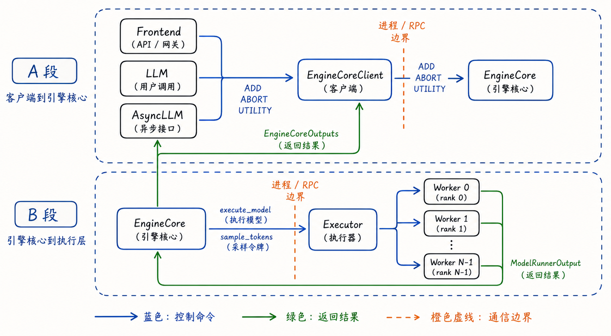
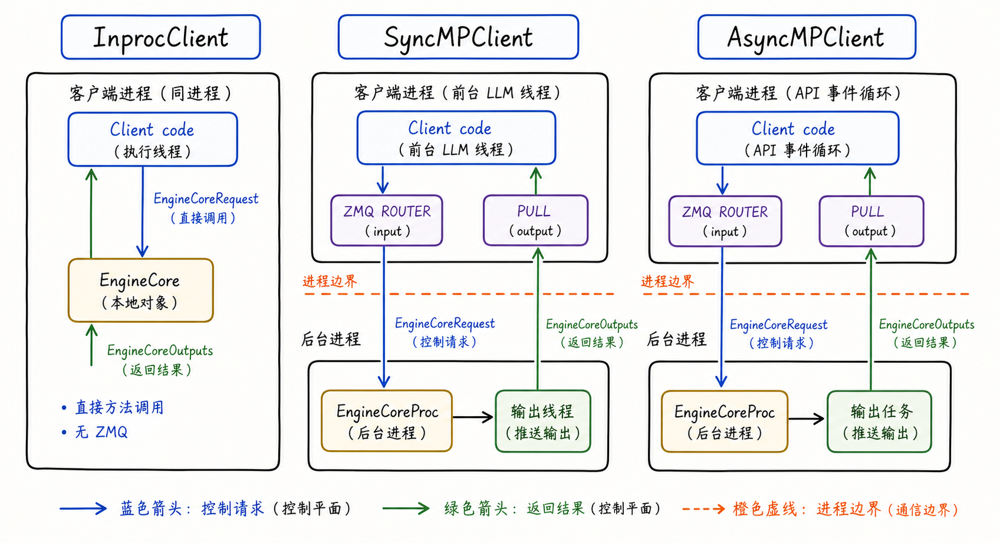
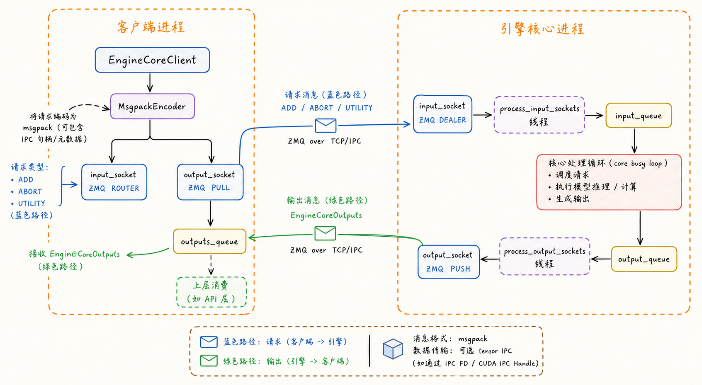
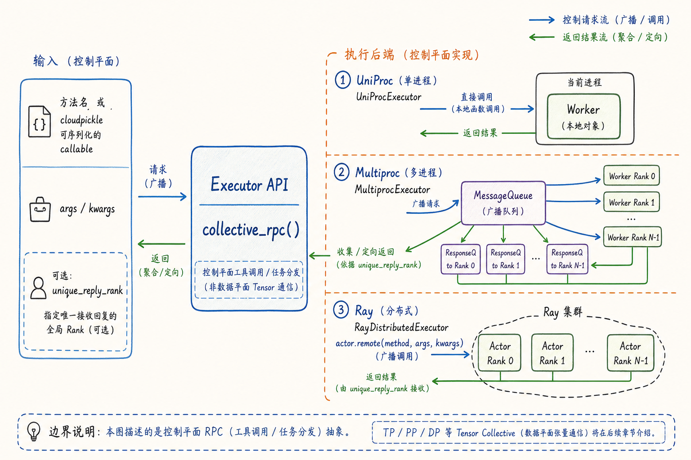
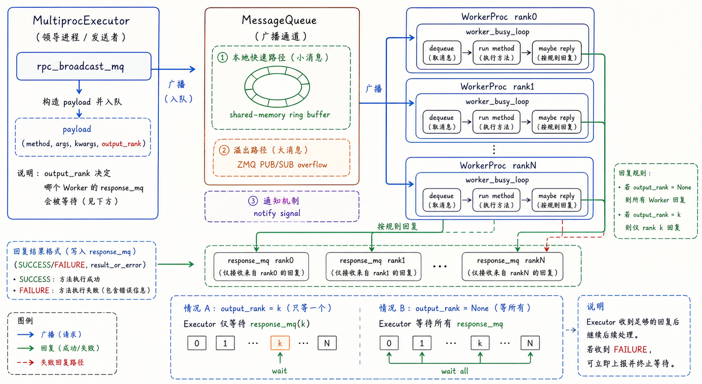
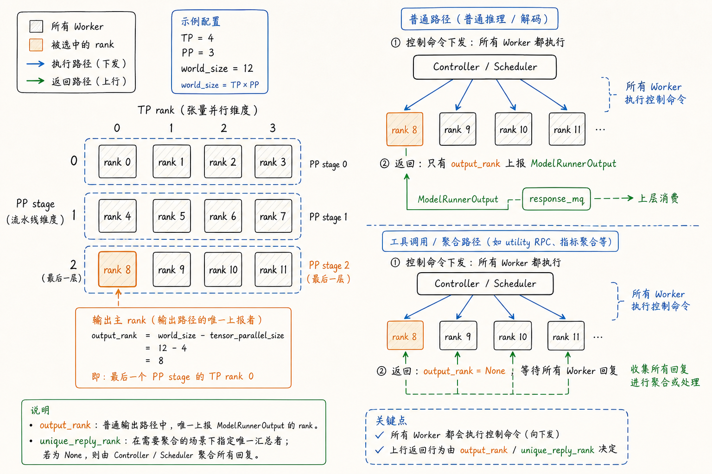

---
tags:
  - vllm
  - llm-inference
  - inference-engine
  - engine-core
  - executor
  - control-plane
  - distributed-inference
updated: 2026-05-31
description: 本文基于本地 vLLM V1 源码快照，系统拆解前端到 EngineCore、EngineCore 到 Worker 的控制面通信路径，说明 ZMQ、msgpack、collective_rpc、MessageQueue、output_rank 如何共同支撑一次推理控制流。
---

# 08 vLLM 控制面通信机制：从 EngineCoreClient 到 Executor RPC

第 7 篇已经把 `Executor`、`Worker` 与 `ModelRunner` 的协同关系讲清楚了：`Scheduler` 产出 `SchedulerOutput`，`Executor` 把执行任务交给 worker，worker 内部的 `ModelRunner` 再把调度结果变成模型输入并返回 `ModelRunnerOutput`。

但第 7 篇只是把通信放在执行协同里讲。它回答的是“这些组件怎样配合”，还没有系统回答另一个更底层的问题：**控制消息到底怎么跨对象、跨线程、跨进程、跨 worker 传过去，又怎么回来**。

这篇就专门讲控制面通信。

所谓控制面，不是 TP/PP/DP 里搬运 GPU tensor 的高频数据面，也不是 KV connector 的跨节点 KV 传输。控制面负责的是“让谁做什么”和“从哪里取结果”：新增请求、终止请求、utility 调用、调度任务单、profile/sleep/wake、LoRA 操作、worker RPC、返回对象和异常状态，都属于这一层。

本文以 `code/opensource/vllm` 的本地源码快照为依据，源码分支为 `main`，短提交哈希为 `52a31ccec`。本文不逐行注释源码，而是建立一张能读源码的控制面地图：**第一段是 Frontend / LLM / AsyncLLM 到 EngineCore，第二段是 EngineCore 到 Executor / Worker**。

先看总览图。蓝色箭头是控制命令，绿色箭头是返回结果，橙色虚线是通信边界。



读这张图时先抓住一个原则：绿色箭头虽然携带对象和结果，但它仍然属于本文的控制面返回路径，不等价于后续要讲的数据面通信。数据面讨论的是模型执行期间的 tensor collective、pipeline intermediate、KV block transfer 等高频数据搬运；本文讨论的是 Python/进程/actor 层面的调度命令和返回对象。

## 1. 控制面为什么分两段

vLLM 的控制面不是一条简单的函数调用链，而是两段不同性质的通信。

第一段是**客户端到 EngineCore**。上层可能是同步 `LLMEngine`，也可能是异步 `AsyncLLM`，还可能是 OpenAI API server 背后的服务对象。它们不应该直接知道 `EngineCore` 是否在同进程、后台进程、多个 DP engine，或者远程 headless engine 里。所以 vLLM 把这层抽成 `EngineCoreClient`。

第二段是**EngineCore 到 worker group**。`EngineCore` 已经完成调度，手里有 `SchedulerOutput`，但它不应该关心实际 worker 是本地对象、多进程子进程，还是 Ray actor。于是 vLLM 又把这层抽成 `Executor`，再由 `Executor.collective_rpc()` 把控制命令发给 worker。

这两段通信的职责不同。

| 控制面段落 | 起点 | 终点 | 典型消息 | 解决的问题 |
| --- | --- | --- | --- | --- |
| 客户端到引擎核心 | `LLMEngine` / `AsyncLLM` / API serving | `EngineCore` / `EngineCoreProc` | `ADD`、`ABORT`、`UTILITY`、`EngineCoreRequest`、`EngineCoreOutputs` | 前端和 EngineCore 是否同进程、是否异步、是否多 DP engine； |
| 引擎核心到执行层 | `EngineCore` | `Executor` / `Worker` | `execute_model`、`sample_tokens`、utility RPC、`SchedulerOutput`、`ModelRunnerOutput` | EngineCore 如何屏蔽 UniProc、Multiproc、Ray 等执行后端； |

如果把两段混在一起读，很容易产生两个误解。

第一个误解是“vLLM 的通信就是 ZMQ”。不对。ZMQ 主要出现在多进程 `EngineCoreClient <-> EngineCoreProc` 这一段，也出现在 `MessageQueue` 的通知和溢出路径里；但 `InprocClient` 可以没有 ZMQ，`UniProcExecutor` 也可以直接本地调用 worker。

第二个误解是“只要看到返回对象，就是数据面”。也不对。`EngineCoreOutputs`、`ModelRunnerOutput`、utility result 这些返回对象仍然是控制面返回；真正的数据面要等进入模型 forward 以后，才会出现 TP all-reduce、PP intermediate tensors、KV transfer 等路径。

所以，第 8 篇和第 7 篇的关系可以这样理解：

1. 第 7 篇建立组件协同关系：谁负责调度、谁负责执行、谁负责设备进程、谁负责张量输入；
2. 第 8 篇下钻控制面通信：控制请求怎样进入 EngineCore，EngineCore 怎样把执行命令广播给 worker，结果怎样返回；
3. 后续章节再讲数据面通信：模型执行中的 tensor、pipeline activation、KV cache 和跨节点传输怎样移动；

这也是本章刻意不展开 KV connector 的原因。KV connector 本身当然包含控制消息和数据传输，但如果还没有先讲 `ModelRunner`、Attention、KV cache、block table 和 serving topology，提前把它放进本章正文会让读者拿不到前置抓手。

## 2. EngineCoreClient 连接 EngineCore

在 vLLM V1 里，上层引擎对象不会直接裸调用 `EngineCore`。同步路径里，`LLMEngine` 初始化 `InputProcessor` 和 `OutputProcessor`，然后通过 `EngineCoreClient.make_client()` 创建 engine core 客户端。`InputProcessor` 把上层输入转成 `EngineCoreRequest`，`OutputProcessor` 把 `EngineCoreOutputs` 转回用户可见的 `RequestOutput`。

`EngineCoreClient` 有三个基础形态：

1. `InprocClient`：`EngineCore` 就在当前进程里，适合同步、本地、V0-style 的 `LLMEngine` 使用；
2. `SyncMPClient`：前台是同步 `LLM` 调用线程，`EngineCore` 在后台进程里，通过 ZMQ 发送请求、接收输出；
3. `AsyncMPClient`：前台是 async API loop，`EngineCore` 仍在后台进程里，通过 async ZMQ socket 和 output task 接收输出；



这张图的重点不是“哪种更高级”，而是三者把同一组语义映射到不同运行方式上。

`InprocClient` 最容易理解。它在构造时直接创建 `EngineCore` 对象，`add_request()` 会先做 `preprocess_add_request()`，再直接调用 `engine_core.add_request()`；`get_output()` 则调用 `engine_core.step_fn()` 和 `post_step()`，最后取出 client 0 的 `EngineCoreOutputs`。这里没有进程边界，也没有 ZMQ，控制面退化为本地方法调用。

`SyncMPClient` 和 `AsyncMPClient` 则是多进程形态。它们继承自 `MPClient`，核心差异是前台如何消费输出：同步客户端用后台线程把 ZMQ output socket 的内容塞进 `queue.Queue`，异步客户端用 asyncio task 把输出塞进 `asyncio.Queue`。这正好对应 `LLMEngine.step()` 和 `AsyncLLM` output handler 的不同消费方式。

这层抽象的价值在于：上层只需要关心 `add_request`、`abort_requests`、`get_output`、`call_utility` 这些语义，不需要把“EngineCore 是否在后台进程里”写进业务逻辑。

源码里可以看到这个边界非常清楚：

1. `EngineCoreClient.make_client()` 根据 `multiprocess_mode` 与 `asyncio_mode` 选择 `InprocClient`、`SyncMPClient` 或 `AsyncMPClient`；
2. `InprocClient` 直接持有 `EngineCore`；
3. `MPClient` 建立 ZMQ `ROUTER` 输入 socket、`PULL` 输出 socket，并启动/连接后台 `EngineCoreProc`；
4. `SyncMPClient.get_output()` 从同步队列拿 `EngineCoreOutputs`；
5. `AsyncMPClient.get_output_async()` 从异步队列拿 `EngineCoreOutputs`；

这里的“client”不是业务客户端，而是 EngineCore 的本地代理。它把前端调用转成 EngineCore 能理解的控制消息。

## 3. ZMQ 边界怎样流动

多进程模式下，前端进程和 `EngineCoreProc` 之间主要靠 ZMQ 与 msgpack 连接。

输入方向是 `EngineCoreClient -> EngineCoreProc`：

1. `MPClient` 持有 input socket，类型是 `ZMQ ROUTER`；
2. 每个 `EngineCoreProc` 用自己的 engine identity 连接这个 ROUTER，进程内对应的是 `ZMQ DEALER`；
3. 客户端发送 multipart message：`(engine_identity, request_type, serialized_request...)`；
4. `request_type` 是 `EngineCoreRequestType`：普通前端控制消息主要是 `ADD`、`ABORT`、`UTILITY`，DP 协调路径还会用到 `START_DP_WAVE`；`EXECUTOR_FAILED`、`WAKEUP` 也定义在枚举里，但它们更像 `EngineCoreProc` 内部用于失败通知和唤醒的哨兵，不应理解成普通客户端请求；
5. 请求体用 `MsgpackEncoder` 编码，必要时还能通过 tensor IPC 处理多模态 tensor；

输出方向是 `EngineCoreProc -> EngineCoreClient`：

1. `EngineCoreProc` 内部把 `EngineCoreOutputs` 放入 `output_queue`；
2. `process_output_sockets()` 线程从 `output_queue` 取出对象；
3. 它用 `MsgpackEncoder.encode_into()` 编码输出，并通过 ZMQ `PUSH` socket 发往客户端的 `PULL` socket；
4. 同步客户端的 output thread 或异步客户端的 output task 解码 `EngineCoreOutputs`；
5. 普通输出进入 output queue，utility 输出根据 `call_id` 唤醒对应 future；



这条路径里有几个实现点值得慢一点看。

第一，`EngineCoreRequestType` 直接定义成 byte string。这样 request type 可以作为 socket frame 发出，不需要额外编码一层。`ADD` 是新增请求，`ABORT` 是终止请求，`UTILITY` 是调用 EngineCore 上的控制方法，`EXECUTOR_FAILED` 是 executor 失败后塞进 EngineCore 输入队列的哨兵。

第二，`EngineCoreRequest` 里有 `client_index`。在前端扩展或多 API server 场景里，输出不能随便回到任意客户端，`client_index` 用来确保 `EngineCoreOutputs` 回到对应的前端消费端。异步 DP load balancing 路径还会把请求记录到选中的 engine 上，方便后续 abort 精准路由。

第三，`EngineCoreProc` 并不是在主循环里直接 poll socket。它把 socket IO 和核心 busy loop 分开：

1. `process_input_sockets()` 线程负责从 ZMQ socket 收消息、解码、做请求预处理，然后塞进 `input_queue`；
2. `run_busy_loop()` 负责从 `input_queue` 处理控制请求，再执行 `step_fn()`；
3. `process_output_sockets()` 线程负责从 `output_queue` 取输出、编码并推送给客户端；

这个设计的关键收益是并发重叠。源码注释明确提到，后台线程可以让 ZMQ socket IO 与 GPU 执行重叠，也能让部分序列化/反序列化和模型 forward 重叠。控制面本身不是 GPU 计算，但它如果阻塞在 socket 或编码上，会直接影响在线推理的调度节奏。

第四，msgpack 序列化不是简单的 `json.dumps`。`MsgpackEncoder` 支持自定义 torch tensor 和 numpy array 序列化，小对象可以内联，大对象可以作为辅助 buffer，配置了 `oob_tensor_consumer` 时还可以把 tensor 交给 tensor IPC。多模态输入的 tensor IPC 则通过 `TensorIpcSender` / `TensorIpcReceiver` 走 `torch.multiprocessing.Queue`，msgpack 里只放轻量 metadata。

这仍然属于控制面，因为它发生在前端请求对象进入 EngineCore 的边界上。它不是模型层里的 TP/PP tensor collective。这里的 tensor IPC 只是避免把请求携带的多模态 tensor 粗暴塞进 msgpack 主体。

最后，utility 调用要单独看。`MPClient.call_utility()` 会生成 `call_id` 和 future，把 `(client_idx, call_id, method, args)` 作为 `UTILITY` 消息发给 `EngineCoreProc`。EngineCore 收到后用 `getattr(self, method_name)` 找到方法执行，再把 `UtilityOutput(call_id, result)` 放回 `output_queue`。客户端解码后用 `call_id` 找到 future，完成同步或异步等待。

这样，`reset_prefix_cache()`、`profile()`、`sleep()`、`wake_up()`、`get_supported_tasks()` 这些控制操作都能复用同一条 ZMQ 控制通道。

## 4. Executor 的 RPC 抽象

当请求进入 `EngineCore` 后，控制面进入第二段：`EngineCore -> Executor -> Worker`。

`EngineCore.step()` 的关键路径仍然是：

```text
scheduler.schedule()
model_executor.execute_model(scheduler_output, non_block=True)
scheduler.get_grammar_bitmask(scheduler_output)
future.result()
model_executor.sample_tokens(grammar_output)  # 如果 execute_model 先返回 None
scheduler.update_from_output(scheduler_output, model_output)
```

这段代码里，`EngineCore` 并不直接拿到 worker 对象。它面对的是 `Executor`。`Executor` 抽象类把 worker 调用统一成 `collective_rpc()`，并在注释里明确提醒：这个 API 推荐只传控制消息，真正的数据面通信应该另行建立。

这句话是本章的边界核心。`collective_rpc()` 适合传：

1. 方法名或可序列化 callable；
2. `args` / `kwargs`；
3. `SchedulerOutput` 这样的控制任务单；
4. `sleep`、`wake_up`、`profile`、LoRA、cache reset 等 utility 命令；
5. 返回对象、异常状态、少量聚合结果；

它不适合承担：

1. TP rank 之间每层 forward 的 all-reduce；
2. PP stage 之间的 `IntermediateTensors`；
3. DP batch 对齐期间的高频张量通信；
4. KV connector 的实际 KV block 搬运；



这张图里，`Executor API` 是控制面抽象点，后面三种执行后端只是实现方式不同。

`UniProcExecutor` 最薄。它只有一个 `driver_worker`，`collective_rpc()` 实际上就是 `run_method(self.driver_worker, method, args, kwargs)`。非阻塞模式也只是把结果包装成 `Future` 或 `AsyncOutputFuture`。它没有跨 worker 广播，但仍然保留 `Executor` 接口，这让单进程执行和多进程执行能复用同一套 `EngineCore` 主逻辑。

`MultiprocExecutor` 是本章最重要的后端。它在 leader 侧创建 `rpc_broadcast_mq`，每个 worker 进程通过 handle 连接这条广播队列，并拥有自己的 `worker_response_mq`。`collective_rpc()` 会把 `(method, args, kwargs, output_rank)` 入队，worker busy loop 取出后执行方法，再按规则把结果写入 response queue。

`RayDistributedExecutor` 的控制面可以分成两块。utility RPC 通过 Ray actor 的 `execute_method.remote()` 发到 worker；模型 forward 路径则可能走 Ray compiled DAG。由于本章只讲控制面，Ray compiled DAG 只作为边界提示：它把 forward 数据流纳入 Ray 图执行，更接近后续数据面章节的内容，不在这里展开。

所以，读 executor 源码时不要问“哪个类才是真正通信”。更好的问题是：**同一个控制语义，在不同后端里被映射成了什么通信机制**。

## 5. MessageQueue 与 worker busy loop

现在进入 `MultiprocExecutor` 的核心。

leader 进程初始化时，如果当前节点是 DP group leader，它会创建 `MessageQueue(world_size, local_world_size, ...)` 作为 `rpc_broadcast_mq`。这条队列的用途是把控制面 RPC 广播给所有 worker。每个 worker 进程初始化时会用 `MessageQueue.create_from_handle(handle, rank)` 连接同一个广播通道。

`MessageQueue` 自己也不是一个普通 Python queue。它把本地读者和远程读者分开处理：

1. 本地 worker 优先走 shared-memory ring buffer；
2. 大消息或 overflow 可以走 ZMQ PUB/SUB frames；
3. 远程 reader 也可以通过 remote PUB/SUB 地址接收；
4. `SpinCondition` 负责通知本地读者何时从共享内存读取；
5. ring buffer 的 metadata 记录 written flag 和每个 reader 的 read flag；

这解释了为什么 `MessageQueue` 比“multiprocessing.Queue 广播一下”复杂得多。vLLM 这里要解决的是“一写多读”的广播：leader 写一次，多个 worker 都要看到同一个控制 payload，而且不能在 worker 还没读完时覆盖共享内存块。

`collective_rpc()` 的发送侧逻辑可以压缩成下面几步：

1. 根据这次调用需要单点回复、全量回复，还是需要先收集多个 worker 输出再聚合，决定 `output_rank` 是否为 `None`；
2. 如果 `method` 是字符串，就直接传方法名；
3. 如果 `method` 是 callable，就用 `cloudpickle` 序列化；
4. 将 `(send_method, args, kwargs, output_rank)` 写入 `rpc_broadcast_mq`；
5. 如果 `output_rank` 不为 `None`，leader 只等待该 rank 的 `response_mq`；
6. 如果 `output_rank` 为 `None`，leader 等待所有 response queue；
7. 每个返回项都是 `(SUCCESS/FAILURE, result_or_error)`；

源码里某些聚合场景会通过 `kv_output_aggregator` 影响这个返回策略。这里先只把它当成“需要多 worker 输出后再聚合”的控制面收集策略，不展开 KV 数据传输本身。



worker 侧则由 `worker_busy_loop()` 接住控制消息。它一直从 `rpc_broadcast_mq.dequeue(indefinite=True)` 取消息，然后：

1. 如果 `method` 是字符串，用 `getattr(self.worker, method)` 找到 worker 方法；
2. 如果 `method` 是 bytes，用 `cloudpickle.loads(method)` 还原 callable，并把 worker 作为第一个参数传入；
3. 执行 `func(*args, **kwargs)`；
4. 如果执行失败，把异常转成失败响应；
5. 如果 `output_rank is None` 或当前 `rank == output_rank`，调用 `handle_output(output)`；
6. `handle_output()` 再把输出写入本 worker 的 `worker_response_mq`；

这里最关键的一点是：**所有 worker 都会收到并执行控制命令，但不一定所有 worker 都向 leader 返回结果**。

对于普通 `execute_model()` 和 `sample_tokens()`，`MultiprocExecutor` 会传入 `unique_reply_rank=self.output_rank`。这意味着所有 worker 都执行方法，但 leader 只等待 `output_rank` 对应的 response queue。对于某些 utility RPC 或需要聚合的路径，`output_rank` 可以是 `None`，leader 就要等所有 worker 返回。

这个设计把两个问题拆开了：

1. 下发问题：控制命令是否需要广播给所有 worker；
2. 上报问题：这轮调用需要谁代表 worker group 返回结果；

很多读源码时的困惑都来自把这两个问题混在一起。`execute_model` 的控制命令会发给所有 worker，因为每个 worker 都要更新本地状态、执行自己 rank 上的模型部分；但 `EngineCore` 往往只需要最后一个 PP stage 且 TP rank 0 的 `ModelRunnerOutput`。所以返回收敛可以只等一个代表 rank。

## 6. output_rank 的返回收敛

`output_rank` 是控制面返回路径里的关键概念。它不是“只有这个 rank 执行模型”，而是“这轮普通推理输出由哪个 rank 向上返回”。

在 `MultiprocExecutor._get_output_rank()` 里，源码注释说得很明确：只从 TP rank 0 且最后一个 PP stage 的 worker 返回 `ModelRunnerOutput`。公式是：

```text
output_rank = world_size - tensor_parallel_size * prefill_context_parallel_size
```

如果暂时不考虑 `prefill_context_parallel_size`，直觉上就是：

```text
output_rank = world_size - tensor_parallel_size
```

例如 TP=4、PP=3，那么 `world_size = 12`。rank 0-3 属于 PP stage 0，rank 4-7 属于 PP stage 1，rank 8-11 属于最后一个 PP stage。最后一个 PP stage 里的 TP rank 0 就是 rank 8，所以普通输出路径只需要 rank 8 把 `ModelRunnerOutput` 往上返回。



为什么这不会丢信息？

因为模型执行的数据面已经在 worker group 内部完成协作。TP rank 间的张量规约、PP stage 间的 intermediate tensors、最后 stage 的采样结果同步，都不是靠 leader 从所有 worker 收一遍 Python 对象来完成的。到了控制面返回阶段，`EngineCore` 需要的是本轮执行的抽象输出：哪些 request 产出了 token，哪些 request 完成，哪些状态要更新。这通常由最后输出 rank 代表上报即可。

`unique_reply_rank` 则是 `collective_rpc()` 的参数语义：调用方告诉 executor，这次 RPC 只需要某个 rank 返回。`MultiprocExecutor` 内部把它转成 `output_rank` 写入广播 payload；worker busy loop 根据这个值决定自己是否写 response queue；leader 也据此只等待一个 response queue。

但不是所有控制面 RPC 都应该只等一个 rank。

例如：

1. 有些初始化、健康检查、内存探测、配置读取要收集每个 worker 的返回；
2. 某些 connector 或扩展路径需要多个 worker 输出后再聚合；
3. Ray 普通 utility RPC 会对所有 worker 发 `execute_method.remote()`，再 `ray.get()` 所有返回；

所以 `output_rank` 的本质不是“优化掉其他 worker”，而是**把返回收敛策略显式编码进控制面 payload**。下发仍然可以是广播，上报可以是单点、全量或聚合。

这也是第 7 篇里“所有 worker 执行”和“只收一个结果”容易混淆的地方。现在可以更精确地表达：

1. Executor 的广播解决“谁要收到命令”；
2. Worker 的 busy loop 解决“每个进程如何执行命令”；
3. `output_rank` / `unique_reply_rank` 解决“谁要把结果写回 leader”；
4. `FutureWrapper` 解决“EngineCore 是同步等结果，还是先拿 future 后等待”；

## 7. 控制面边界与后续地图

到这里，vLLM V1 的控制面主链路已经可以串起来了。

一次新增请求会先在前端被加工成 `EngineCoreRequest`。如果是 `InprocClient`，它直接进入当前进程里的 `EngineCore`；如果是 `SyncMPClient` 或 `AsyncMPClient`，它会被 msgpack 编码，通过 ZMQ ROUTER/DEALER 进入后台 `EngineCoreProc`，再由 input socket 线程放入 `input_queue`。EngineCore busy loop 处理 `ADD`、`ABORT`、`UTILITY` 等请求，并在有调度工作时调用 `step_fn()`。

`step_fn()` 内部由 Scheduler 生成 `SchedulerOutput`。接着 `EngineCore` 调用 `model_executor.execute_model()`。如果是 UniProc，这就是本地 worker 方法调用；如果是 Multiproc，它会通过 `rpc_broadcast_mq` 把 `(method, args, kwargs, output_rank)` 广播到 worker 进程；如果是 Ray utility RPC，则会变成 actor remote method；如果是 Ray forward 路径，则会进入 Ray compiled DAG 的边界。

worker 执行完成后，普通 multiproc 路径通常只由 `output_rank` 把 `ModelRunnerOutput` 写回对应的 response queue。Executor 得到结果后返回给 EngineCore，EngineCore 再让 Scheduler 更新状态并产出 `EngineCoreOutputs`。最后，多进程 `EngineCoreProc` 通过 output socket 把 `EngineCoreOutputs` 推回 `EngineCoreClient`，上层 `OutputProcessor` 再把它转成用户可见输出。

这就是本章要建立的完整控制面心智模型：

```text
Frontend / LLM / AsyncLLM
  -> EngineCoreClient
  -> EngineCore / EngineCoreProc
  -> Executor.collective_rpc()
  -> WorkerProc.worker_busy_loop()
  -> Worker method
  -> response_mq / output_rank
  -> EngineCore
  -> EngineCoreOutputs
  -> EngineCoreClient
  -> OutputProcessor
```

本章没有展开数据面，不是因为它不重要，而是因为它需要后续前置知识。一个合理的后续顺序是：

1. 先讲 `ModelRunner` 如何把 `SchedulerOutput` 变成 input ids、positions、block table、attention metadata 和 sampling metadata；
2. 再讲 Attention 与 KV cache 的执行结构；
3. 再讲 Sampler 与 OutputProcessor 的返回路径；
4. 然后单独讲 TP/PP/DP 的模型执行数据面通信；
5. 最后在 KV cache、prefix cache、disaggregated prefill 和 serving topology 铺好后，再讲 KV connector 与跨节点 KV transfer；

这样拆分后，第 8 篇的位置就很清楚：它不是“vLLM 所有通信机制精讲”，而是**控制面通信精讲**。它负责把命令、请求、调度结果和返回对象的路径讲明白；至于 GPU tensor、pipeline activation、KV block 怎样移动，应该交给后续的数据面章节。

## 参考资料

1. vLLM 本地源码快照：`code/opensource/vllm`，分支 `main`，短提交哈希 `52a31ccec`；
2. EngineCoreClient 抽象与 inproc/mp client：`code/opensource/vllm/vllm/v1/engine/core_client.py`；
3. EngineCore 与 EngineCoreProc busy loop：`code/opensource/vllm/vllm/v1/engine/core.py`；
4. EngineCoreRequest、EngineCoreOutputs、EngineCoreRequestType：`code/opensource/vllm/vllm/v1/engine/__init__.py`；
5. EngineCore 进程启动、ZMQ 地址与握手：`code/opensource/vllm/vllm/v1/engine/utils.py`；
6. msgpack 序列化与 tensor / ndarray 辅助 buffer：`code/opensource/vllm/vllm/v1/serial_utils.py`；
7. API server 到 EngineCore 的 tensor IPC：`code/opensource/vllm/vllm/v1/engine/tensor_ipc.py`；
8. Executor 抽象与 `collective_rpc()`：`code/opensource/vllm/vllm/v1/executor/abstract.py`；
9. UniProcExecutor：`code/opensource/vllm/vllm/v1/executor/uniproc_executor.py`；
10. MultiprocExecutor、WorkerProc、worker busy loop：`code/opensource/vllm/vllm/v1/executor/multiproc_executor.py`；
11. MessageQueue 与 shared-memory ring buffer：`code/opensource/vllm/vllm/distributed/device_communicators/shm_broadcast.py`；
12. Ray executor 与 Ray worker utils：`code/opensource/vllm/vllm/v1/executor/ray_executor.py`、`code/opensource/vllm/vllm/v1/executor/ray_utils.py`；
13. 同步 LLMEngine 输入输出路径：`code/opensource/vllm/vllm/v1/engine/llm_engine.py`；
14. 异步 AsyncLLM 输入输出路径：`code/opensource/vllm/vllm/v1/engine/async_llm.py`；

## Learning Assessment

### 题目

1. 单选：本文把 vLLM 控制面通信拆成两段，最准确的是哪一项？
   A. Tokenizer 到 Sampler，以及 Sampler 到 Detokenizer；
   B. Frontend / EngineCoreClient 到 EngineCore，以及 EngineCore / Executor 到 Worker；
   C. TP rank 到 TP rank，以及 PP stage 到 PP stage；
   D. KV cache 到 GPU memory，以及 GPU memory 到 CPU memory；

2. 单选：`InprocClient` 与 `SyncMPClient` 的关键区别是什么？
   A. `InprocClient` 不支持 `EngineCoreRequest`；
   B. `SyncMPClient` 必须直接调用本地 `EngineCore.step_fn()`；
   C. `InprocClient` 在同进程直接调用 `EngineCore`，`SyncMPClient` 通过 ZMQ 连接后台 `EngineCoreProc`；
   D. `InprocClient` 只用于 Ray，`SyncMPClient` 只用于 TP；

3. 多选：多进程 `EngineCoreClient <-> EngineCoreProc` 路径中，哪些说法是正确的？
   A. input side 使用 `ROUTER/DEALER` 形态传入请求；
   B. output side 使用 `PUSH/PULL` 形态返回 `EngineCoreOutputs`；
   C. 请求和输出都完全依赖 JSON 文本序列化；
   D. `MsgpackEncoder` / `MsgpackDecoder` 可以处理 tensor / ndarray 的辅助 buffer；

4. 单选：`EngineCoreRequestType.UTILITY` 主要解决什么问题？
   A. 把所有 GPU tensor 从一个 rank 复制到另一个 rank；
   B. 让客户端通过控制通道调用 EngineCore 上的控制方法，并通过 `call_id` 取回结果；
   C. 替代 `SchedulerOutput`，直接描述每个 token 的 logits；
   D. 在 PP stage 之间传输 intermediate tensors；

5. 多选：为什么 `EngineCoreProc` 要把 socket IO 和 core busy loop 分开？
   A. 可以让 ZMQ IO 与 GPU 执行或序列化工作部分重叠；
   B. input socket 线程可以先把请求解码、预处理后放入 `input_queue`；
   C. output socket 线程可以从 `output_queue` 编码并推送结果；
   D. 分开以后 Scheduler 就不需要维护请求状态；

6. 单选：`Executor.collective_rpc()` 在本文中的定位是什么？
   A. 负责所有 TP/PP/DP tensor collective 的底层实现；
   B. 负责把控制面方法调用统一映射到不同 executor 后端；
   C. 负责替代 `EngineCoreClient` 与前端通信；
   D. 负责直接解析 HTTP 请求；

7. 多选：关于 `MultiprocExecutor.collective_rpc()` 的广播 payload 和返回等待策略，哪些说法是正确的？
   A. payload 会包含 `method`、`args`、`kwargs` 与 `output_rank`；
   B. 如果 `method` 是 callable，可能需要先用 `cloudpickle` 序列化；
   C. `output_rank` 决定哪些 worker 收到广播命令；
   D. `output_rank=None` 时 leader 可能需要等待多个 worker 的 response；

8. 单选：`worker_busy_loop()` 的核心工作是什么？
   A. 只在最后一个 PP stage 上运行，其它 worker 不需要 busy loop；
   B. 从 `rpc_broadcast_mq` 取控制命令，执行对应 worker 方法，并按 `output_rank` 决定是否回复；
   C. 只负责把 HTTP response 写回客户端；
   D. 只负责创建 tokenizer；

9. 单选：普通 `execute_model()` 路径里，为什么通常只等待 `output_rank` 的 response queue？
   A. 因为只有 `output_rank` 对应的 worker 真正执行模型；
   B. 因为其他 worker 没有收到控制命令；
   C. 因为 worker group 内部已经完成必要协作，控制面只需要一个代表 rank 上报 `ModelRunnerOutput`；
   D. 因为 `output_rank` 会把所有 GPU tensor 都复制回 CPU；

10. 多选：按控制面 / 数据面边界判断，哪些属于模型执行期间的数据面通信，而不是 EngineCore / Executor 控制面 RPC？
    A. TP all-reduce / all-gather；
    B. PP intermediate tensors；
    C. KV connector 的实际 KV block transfer；
    D. `EngineCoreRequestType.ADD`；

11. 单选：`MessageQueue` 为什么不是一个普通的单消费者队列？
    A. 因为它要支持 leader 写一次、多个 worker 都能读到同一个广播 payload；
    B. 因为它只服务一个 worker；
    C. 因为它只能传字符串，不能传 Python 对象；
    D. 因为它完全不需要同步元数据；

12. 多选：关于 `output_rank` 和 `unique_reply_rank`，哪些理解是正确的？
    A. `unique_reply_rank` 是调用侧表达“只需要某个 rank 回复”的参数语义；
    B. `output_rank` 写进广播 payload 后，worker busy loop 会用它判断是否写 response queue；
    C. `output_rank` 表示只有该 rank 收到控制命令；
    D. `output_rank=None` 可以表示 leader 需要等待多个或所有 worker 的回复；

13. 单选：如果未来新增一个 executor 后端，最应该保留哪条边界？
    A. 让 `EngineCore` 直接依赖该后端的具体 worker 进程实现；
    B. 让前端直接调用每个 worker 的 `execute_model()`；
    C. 让 `EngineCore` 继续面向统一 `Executor` 控制面接口，由后端自己实现广播、等待和返回收敛；
    D. 把所有控制消息都改成 GPU collective；

### 答案与解析

1. B。本文的两段控制面是前端到 EngineCore、EngineCore 到 Worker。C 和 D 属于后续数据面或存储/传输主题；
2. C。`InprocClient` 直接持有本地 `EngineCore`，`SyncMPClient` 通过 ZMQ 与后台 `EngineCoreProc` 通信；
3. A、B、D。多进程路径用 ZMQ socket 与 msgpack 编码，不是 JSON 文本序列化；
4. B。`UTILITY` 把控制方法调用放进同一条 EngineCore 控制通道，`call_id` 用来匹配返回 future；
5. A、B、C。分离 socket IO 和 core busy loop 可以减少控制面阻塞，Scheduler 仍然需要维护请求状态，D 错；
6. B。`collective_rpc()` 是 executor 后端的控制面抽象。TP/PP/DP tensor collective 不应被理解成 Python RPC；
7. A、B、D。Multiproc 广播 payload 会包含方法、参数和返回策略；callable 可能需要先被 `cloudpickle` 序列化。C 错在把“谁回复”误解成“谁收到广播”，worker 仍然可以都收到并执行控制命令；
8. B。worker busy loop 取广播命令、解析方法、执行 worker 方法，并按返回规则写 response queue；
9. C。所有相关 worker 都可能执行控制命令，但普通返回路径只需要代表 rank 上报抽象输出；
10. A、B、C。TP collective、PP intermediate tensors、KV block transfer 都发生在模型执行或 KV 传输的数据面；`ADD` 是把请求交给 EngineCore 的控制面消息；
11. A。`MessageQueue` 解决的是一写多读广播，还要处理共享内存块何时可写、每个 reader 是否已读；
12. A、B、D。C 错在把“谁回复”误解成“谁收到命令”。下发可以是所有 worker，返回可以只收一个 rank；
13. C。新增后端应该保留 `EngineCore -> Executor` 的控制面边界，让后端内部处理 worker 通信形态；
