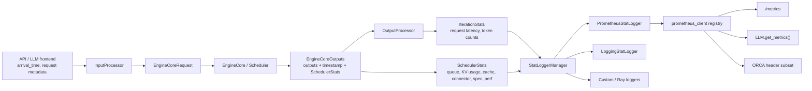

# vLLM 监控指标体系架构设计与实现分析

本文基于当前仓库快照分析 vLLM V1 引擎的监控指标体系。这里的“监控指标”主要指 Prometheus/日志/离线读取暴露的指标数据，同时也覆盖与生产监控紧密相关的 HTTP 自动指标、`/load` 负载接口、ORCA 响应头、Ray metrics 适配和 OpenTelemetry tracing 的边界。

## 1. 总体结论

vLLM 的指标体系不是在模型执行热路径里直接写 Prometheus，而是采用“引擎内核产生轻量事实，前端进程计算和发布指标”的架构。

核心设计可以概括为四层：

1. **事实采集层**：`EngineCore`、`Scheduler`、`KVCacheManager`、spec decode、KV connector、MFU 估算等模块收集最小必要统计，产出 `SchedulerStats`、`IterationStats` 所需的原始事件和计数。
2. **前端聚合层**：`AsyncLLM` 或同步 `LLMEngine` 在处理 `EngineCoreOutputs` 时生成 `IterationStats`，并把 scheduler 侧 stats、iteration stats、多模态 cache stats 一起交给 `StatLoggerManager`。
3. **发布适配层**：`StatLoggerManager` 同时驱动 `LoggingStatLogger`、`PrometheusStatLogger`、自定义插件 logger、Ray logger 等发布器。
4. **消费入口层**：OpenAI API server 挂载 `/metrics`；离线 `LLM.get_metrics()` 从 Prometheus 内存 registry 取快照；批处理模式可单独启动 Prometheus HTTP server；OpenAI endpoint 还可从 Prometheus gauge 中生成 ORCA `endpoint-load-metrics` header。

这个架构的主目标是：把昂贵或较多 Python bookkeeping 放在 frontend/output processor 侧，而不是放在 EngineCore 的调度和 GPU forward 内环；同时让同一份 stats 能被日志、Prometheus、自定义 logger 和离线 API 复用。



## 2. 关键源码地图

设计文档与用户文档：

- `docs/design/metrics.md`：V1 metrics 设计背景，解释为什么以 EngineCore 事件和 frontend stats 为中心。
- `docs/usage/metrics.md`：面向用户的 Production Metrics 文档入口，指标表由 mkdocs hook 生成。
- `docs/mkdocs/hooks/generate_metrics.py`：用 AST 扫描指标定义源码，生成 `docs/generated/metrics/*.inc.md`。

核心指标数据结构：

- `vllm/v1/metrics/stats.py`：`SchedulerStats`、`IterationStats`、`RequestStateStats`、`FinishedRequestStats`、`CachingMetrics`、`PromptTokenStats` 等。
- `vllm/v1/engine/__init__.py`：`EngineCoreEventType`、`EngineCoreEvent`、`EngineCoreOutput`、`EngineCoreOutputs`。
- `vllm/v1/request.py`：请求对象记录 EngineCore 事件、prefill stats。

采集链路：

- `vllm/v1/core/sched/scheduler.py`：调度器记录排队、调度、抢占、KV cache、prefix cache、spec decode、KV connector、MFU stats。
- `vllm/v1/core/kv_cache_manager.py`：prefix cache 查询/命中统计和 KV cache usage。
- `vllm/v1/core/kv_cache_metrics.py`：KV cache block residency 采样指标。
- `vllm/v1/engine/output_processor.py`：按 EngineCore 输出更新 request-level latency、token、finished request stats。
- `vllm/renderers/base.py`：多模态 processor/cache stats 的来源之一。

发布链路：

- `vllm/v1/metrics/loggers.py`：`StatLoggerBase`、`LoggingStatLogger`、`PrometheusStatLogger`、`StatLoggerManager`。
- `vllm/v1/metrics/prometheus.py`：Prometheus registry/multiprocess 目录管理、vLLM metrics unregister。
- `vllm/entrypoints/serve/instrumentator/metrics.py`：FastAPI `/metrics` 挂载与 HTTP middleware 指标。
- `vllm/v1/metrics/reader.py`：`LLM.get_metrics()` 背后的 registry 快照读取器。
- `vllm/v1/metrics/ray_wrappers.py`：把 Prometheus logger API 适配到 Ray `ray.util.metrics`。

扩展指标：

- `vllm/v1/spec_decode/metrics.py`：speculative decoding 指标。
- `vllm/v1/metrics/perf.py`：MFU 相关估算 FLOPs/bytes 指标。
- `vllm/distributed/kv_transfer/kv_connector/v1/metrics.py`：KV connector metrics 抽象。
- `vllm/distributed/kv_transfer/kv_connector/v1/nixl/stats.py`：NIXL KV transfer 指标。
- `vllm/distributed/kv_transfer/kv_connector/v1/offloading/metrics.py`：KV offloading 指标。

辅助监控入口：

- `vllm/entrypoints/serve/instrumentator/basic.py`：`/load`。
- `vllm/entrypoints/openai/orca_metrics.py`：ORCA endpoint load metrics header。
- `vllm/entrypoints/openai/server_utils.py`：API server 生命周期中周期性强制 log stats。
- `vllm/entrypoints/openai/run_batch.py` 与 `vllm/entrypoints/cli/run_batch.py`：batch runner 的 `--enable-metrics`。

## 3. 设计目标与边界

### 3.1 目标

`docs/design/metrics.md` 明确把指标分为两类：

- **server-level metrics**：描述 engine 当前状态，例如 running/waiting request、KV cache usage、prefix cache counters。
- **request-level metrics**：描述单个请求的大小与耗时，通常以 histogram 暴露，例如 TTFT、ITL、E2E latency、queue/prefill/decode/inference time。

vLLM 的核心监控思想是：server-level 指标用于解释 request-level 指标。当用户看到 TTFT、TPOT 或 E2E 延迟恶化时，可以用队列长度、KV cache usage、prefix cache 命中、preemption、token throughput、spec decode、KV transfer 等指标去定位原因。

### 3.2 Metrics 与 tracing 的边界

当前仓库把 metrics 和 OpenTelemetry tracing 分开处理：

- metrics 聚合多个请求/时间窗口，用于生产监控、容量规划、SLO、autoscaling。
- tracing 跟踪单个请求穿越组件的路径，由 `ObservabilityConfig.otlp_traces_endpoint` 与 `collect_detailed_traces` 控制。
- `model_forward_time`、`model_execute_time` 一类高精度 timing 更偏 tracing 语义，文档也提醒它们可能带来性能影响。

### 3.3 性能边界

设计上刻意避免在 EngineCore 内做过多 Prometheus 操作。Prometheus client 的 labels、histogram observe、registry 操作都可能引入 Python 开销；因此 EngineCore 只负责记录轻量事件和聚合数值，最终 Prometheus `inc/set/observe` 发生在 frontend 的 logger 层。

## 4. 配置与开关

主要配置集中在 `ObservabilityConfig` 和 CLI 参数：

- `--disable-log-stats`：关闭默认 stats logging。注意自定义 stat logger 存在时，`AsyncLLM` 会把 `log_stats` 重新打开，但不启用默认 logger。
- `--show-hidden-metrics-for-version`：临时重新暴露已隐藏的 deprecated metrics。
- `--kv-cache-metrics` 与 `--kv-cache-metrics-sample`：开启 KV cache block residency 采样指标。
- `--cudagraph-metrics`：开启 CUDA graph 相关日志指标。
- `--enable-mfu-metrics`：开启 MFU 估算指标。
- `--enable-logging-iteration-details`：开启每轮 iteration 的详细日志。
- `--otlp-traces-endpoint` 与 `--collect-detailed-traces`：OpenTelemetry tracing。
- OpenAI frontend 侧还有 `--enable-server-load-tracking`，用于 `/load` 的轻量 server load 计数。
- batch runner 侧有 `--enable-metrics`，会启动独立 Prometheus HTTP server。

配置层值得注意的点：

- `ObservabilityConfig.show_hidden_metrics` 不是简单 truthy，而是用当前版本与传入版本做 previous minor 判断。
- `kv_cache_metrics_sample` 被限制在 `(0, 1]`。
- `collect_detailed_traces` 必须配合 `otlp_traces_endpoint`，否则 validator 直接报错。

## 5. 数据模型

### 5.1 EngineCore 事件

`EngineCoreEventType` 当前包括：

- `QUEUED`：请求进入 engine core 并入调度队列。
- `SCHEDULED`：请求首次或再次被调度执行。
- `PREEMPTED`：请求被抢占并回到等待队列。

`EngineCoreEvent` 使用 `time.monotonic()` 作为 timestamp。设计文档强调 monotonic timestamp 只能在同一进程内比较；因此 queue/prefill/decode/inference 这类区间必须使用 engine core 进程产生的一组 monotonic 时间。

### 5.2 SchedulerStats

`SchedulerStats` 是 scheduler 每轮输出给 frontend 的 server-level stats 容器，包含：

- running/waiting/skipped waiting request 数。
- DP 内部 load-balancing 相关 step/wave 字段。
- `kv_cache_usage`。
- local prefix cache stats 与 connector prefix cache stats。
- KV cache eviction events。
- spec decoding stats。
- KV connector stats。
- LoRA waiting/running adapter 统计。
- CUDA graph stats。
- MFU perf stats。

Scheduler 侧 `make_stats()` 只在 `log_stats` 为真时返回 `SchedulerStats`，否则返回 `None`。这让大部分指标采集可以随 `--disable-log-stats` 一起关闭。

### 5.3 IterationStats

`IterationStats` 是 frontend 在处理一批 `EngineCoreOutput` 时构造的 per-iteration stats。它保存：

- generation token 总数。
- prompt token 来源拆分：local compute、local cache hit、external KV transfer。
- preemption/corrupted request 数。
- finished request stats。
- 每轮的 max generation tokens、`n` 参数、TTFT、ITL。

`IterationStats.update_from_output()` 负责把单个 request output 的 token、prefill stats、event、first token、ITL 等合并进本轮统计。

### 5.4 RequestStateStats 与 FinishedRequestStats

`RequestStateStats` 是跨增量输出保存的 per-request 状态，包含：

- frontend `arrival_time`，当前使用 wall-clock，用于 E2E/TTFT 这类从前端接收请求开始的指标。
- engine core `queued_ts`、`scheduled_ts`、`first_token_ts`、`last_token_ts`，全部是 monotonic。
- 已生成 token 数、first token latency、是否 corrupted。

请求完成时生成 `FinishedRequestStats`，记录：

- finish reason。
- e2e latency。
- prompt/generation token 数。
- queued/prefill/inference/decode time。
- mean time per output token。
- max tokens 参数。
- cached token 数。

## 6. 指标采集主链路

### 6.1 请求进入与 arrival_time

API/LLM frontend 生成 `EngineCoreRequest` 时会带上 `arrival_time`。`OutputProcessor.add_request()` 把它保存到 `RequestState.stats` 中。对于 streaming input，后续 update 会刷新 `arrival_time` 并重置 prefill 状态。

这个设计意味着：

- E2E latency 是 frontend arrival 到 frontend 收到最终 token 的时间。
- TTFT 是 frontend arrival 到 frontend 处理 first token 的时间，因此包含 tokenization/input processing 等前端开销。
- queue/prefill/decode/inference 则尽量使用 EngineCore 内 monotonic 事件，避免跨进程 monotonic 比较。

### 6.2 Scheduler 侧事件与 server stats

Scheduler 初始化时接收 `log_stats`。开启后：

- 新请求入队会记录 `QUEUED`。
- request 被调度时记录 `SCHEDULED`。
- request 被抢占时记录 `PREEMPTED`。
- `KVCacheManager.get_computed_blocks()` 在查 prefix cache 时更新 `PrefixCacheStats`。
- `Scheduler.make_stats()` 每轮把 running/waiting、KV usage、prefix stats、KV connector stats、spec stats、perf stats 等封装成 `SchedulerStats`。

`Scheduler.update_from_output()` 会把 `SchedulerStats` 放入 `EngineCoreOutputs.scheduler_stats`。为了多 frontend/API server 场景，scheduler stats 只返回给一个 frontend；否则同一轮 stats 可能被重复记录。

### 6.3 EngineCoreOutputs timestamp

`EngineCoreOutputs` 自带 `timestamp`，默认使用 `time.monotonic()`。OutputProcessor 使用这个 batch-level timestamp 作为 `NEW_TOKENS` 事件时间：

- 如果 request 正在 prefill，记录 `first_token_ts`。
- 如果已经 decode，使用当前 timestamp 与上一次 `last_token_ts` 的差作为 ITL。
- 每次更新 `last_token_ts`。

这比在每个 request output 上重复放 token timestamp 更轻量。

### 6.4 OutputProcessor 计算 request-level 指标

`OutputProcessor.process_outputs()` 是 V1 中处理 `EngineCoreOutputs` 的核心循环。源码注释明确强调：为了降低 Python 循环开销，尽量只在这个函数里遍历 batch。

其指标职责是：

- 调用 `_update_stats_from_output()` 更新 `IterationStats`。
- 在 prefill 完成时记录 prompt token 来源和 TTFT。
- 处理 EngineCore events，更新 queued/scheduled/preempted 状态。
- 请求完成时生成 `FinishedRequestStats`。
- 更新 LoRA waiting/running request state。

### 6.5 AsyncLLM 与 LLMEngine 的差异

异步服务路径：

- `AsyncLLM` 创建 `OutputProcessor` 和 `EngineCoreClient`。
- 后台 `output_handler` 从 EngineCore 拉取 `EngineCoreOutputs`。
- 每批输出创建 `IterationStats`。
- 调用 `output_processor.process_outputs()` 和 `output_processor.update_scheduler_stats()`。
- 调用 `logger_manager.record(engine_idx, scheduler_stats, iteration_stats, mm_cache_stats)`。

同步离线路径：

- `LLMEngine.step()` 同步拉取 EngineCore 输出。
- 同样创建 `IterationStats` 并调用 `OutputProcessor`。
- 若 `logger_manager` 存在且有 scheduler stats 和 outputs，则调用 `record()` 并按 `VLLM_LOG_STATS_INTERVAL` 触发 `log()`。

两条路径最终收敛到同一个 `StatLoggerManager`。

## 7. 发布架构

### 7.1 StatLoggerBase 与插件机制

`StatLoggerBase` 定义了三类核心方法：

- `record(scheduler_stats, iteration_stats, mm_cache_stats, engine_idx)`：记录一轮 stats。
- `log_engine_initialized()`：engine 初始化后记录静态 info，例如 cache config。
- `log()`：周期性输出日志型指标。

`load_stat_logger_plugin_factories()` 通过 plugin group 加载自定义 logger，并校验必须是 `StatLoggerBase` 子类。测试插件 `tests/plugins/vllm_add_dummy_stat_logger` 展示了最小实现方式。

### 7.2 StatLoggerManager

`StatLoggerManager` 抽象了“一个 frontend 管多个 EngineCore/DP engine”时的 logger 分发问题：

- Local logging 可以为每个 engine 建一个 logger，也可以聚合。
- Prometheus 使用同一个 logger，但用 `engine` label 区分不同 EngineCore。
- 自定义 per-engine logger 会通过 `PerEngineStatLoggerAdapter` 包装成 aggregate 接口。
- 如果没有自定义 Prometheus logger，manager 总会追加默认 `PrometheusStatLogger`。
- 如果传入 `RayPrometheusStatLogger` 这类 `PrometheusStatLogger` 子类，它会替换默认 Prometheus logger，避免重复发布。

一个细节：`disable_log_stats=True` 时默认 logger 不启用，但如果传入自定义 stat logger，`AsyncLLM` 会把 `self.log_stats` 打开，并提示“启用 logging without default stat loggers”。这保证自定义 logger 仍能收到 scheduler/iteration stats。

### 7.3 LoggingStatLogger

`LoggingStatLogger` 面向开发、调试、ad-hoc 观察。它默认每个 `VLLM_LOG_STATS_INTERVAL` 输出：

- prompt throughput。
- generation throughput。
- running/waiting/deferred request 数。
- preemptions。
- GPU KV cache usage。
- prefix cache hit rate。
- external prefix cache hit rate。
- multimodal cache hit rate。
- spec decoding summary。
- KV transfer summary。
- CUDA graph/MFU summary。

与 Prometheus 不同，日志里的 cache hit rate 使用 `CachingMetrics` 的滑动窗口，默认最近 1000 个请求，更适合人类阅读。

`AggregatedLoggingStatLogger` 会对多个 engine 的 scheduler stats 做聚合：running/waiting/deferred 求和，KV cache usage 求平均。它明确禁用 per-GPU perf stats 聚合，因为跨 engine 简单相加/平均可能误导。

### 7.4 PrometheusStatLogger

`PrometheusStatLogger` 是生产指标的核心发布器。初始化时：

- 调用 `unregister_vllm_metrics()` 清理已有 vLLM collectors，主要服务测试和重复构造场景。
- 设置 labelnames 为 `["model_name", "engine"]`。
- 为每个 engine 建立 label child，后续通过 `engine_idx` 记录。
- 初始化 spec decode、KV connector、MFU 子发布器。
- 注册所有 gauge/counter/histogram。

记录时：

- `scheduler_stats` 驱动 server-level gauge/counter。
- `mm_cache_stats` 驱动多模态 cache counter。
- `iteration_stats` 驱动 token counters、request histograms、latency histograms、success counters。
- `finished_requests` 中每个请求都会更新 request-level histograms。

Prometheus client 对 Counter 的 text exposition 会自动添加 `_total` 后缀。因此源码中定义 `name="vllm:prompt_tokens"`，`/metrics` 输出中会看到 `vllm:prompt_tokens_total`。

### 7.5 RayPrometheusStatLogger

`RayPrometheusStatLogger` 复用 PrometheusStatLogger 的注册/record 逻辑，但把底层 Gauge/Counter/Histogram 类替换成 Ray wrapper：

- metric name 会把 `:` 等不符合 Ray/OpenTelemetry 约束的字符替换为 `_`。
- 自动加上 `ReplicaId` tag。
- Ray metrics 自带 worker 维度，所以 Prometheus multiprocess mode 参数在 wrapper 中被忽略。

这说明 vLLM 的 logger 层有意保持“Prometheus client 形状”的抽象接口，从而让不同 metrics backend 共享绝大部分业务逻辑。

## 8. Prometheus HTTP 暴露

### 8.1 `/metrics` 挂载

OpenAI API server 构建 FastAPI app 时会调用 `register_vllm_serve_api_routers()`，其中 instrumentator router 会挂载：

- `/health`、`/load`、`/version` 等基础接口。
- `/metrics`。
- offline docs。

`vllm/entrypoints/serve/instrumentator/metrics.py` 做了两件事：

1. 使用 `prometheus_fastapi_instrumentator.Instrumentator` 添加 HTTP request metrics，并排除 `/metrics`、`/health`、`/load`、`/ping`、`/version`、`/server_info`，避免健康检查和 metrics 自身污染访问指标。
2. 使用 `prometheus_client.make_asgi_app(registry=registry)` 挂载真正的 `/metrics` ASGI app，并修正 `/metrics` 307 redirect 问题。

`PrometheusResponse` 显式设置 `Content-Type` 为 Prometheus text format。

### 8.2 registry 与 multiprocess

`vllm/v1/metrics/prometheus.py` 根据环境变量决定 registry：

- 没有 `PROMETHEUS_MULTIPROC_DIR` 时，使用默认 `prometheus_client.REGISTRY`。
- 有该环境变量时，创建新的 `CollectorRegistry`，并挂上 `multiprocess.MultiProcessCollector`。

当 `vllm serve` 的 `api_server_count > 1` 时，CLI 会调用 `setup_multiprocess_prometheus()`：

- 如果用户没设置 `PROMETHEUS_MULTIPROC_DIR`，vLLM 创建临时目录并写入环境变量。
- 如果用户已设置，会打印 warning，要求目录必须在不同 vLLM run 之间清理，否则指标可能不准确。
- `AsyncLLM.shutdown()` 会调用 `shutdown_prometheus()`，通过 `multiprocess.mark_process_dead()` 标记当前进程死亡。

### 8.3 多 API server 的语义限制

多 API server 场景是指标体系里最容易踩坑的部分：

- Prometheus multiprocess 可以聚合多个 API server 进程的 registry。
- 但 Python/process 默认指标在 multiprocess mode 下不可用，设计文档也明确指出这类指标在 `--api-server-count > 1` 时缺失。
- `StatLoggerManager` 在 `client_count > 1` 时会禁用默认文本 stats logging，避免每个 API server 只看到部分请求却打印“貌似完整”的日志。
- `PrometheusStatLogger` 仍以 `engine` label 区分多个 EngineCore。
- 部分指标源码有 TODO/警告，例如 `vllm:iteration_tokens_total`、`vllm:lora_requests_info` 在多 API server 或 DP 场景可能不完全准确或有误导性。

## 9. 指标类别与语义

### 9.1 调度器与容量状态

主要指标：

- `vllm:num_requests_running`：当前在 model execution batches 中的请求数。
- `vllm:num_requests_waiting`：等待处理的请求数，等于 capacity waiting 加 deferred waiting。
- `vllm:num_requests_waiting_by_reason{reason="capacity|deferred"}`：等待原因拆分。
- `vllm:kv_cache_usage_perc`：KV cache 使用率，1 表示 100%。
- `vllm:engine_sleep_state{sleep_state="awake|weights_offloaded|discard_all"}`：sleep/wake 状态。

`deferred` 的语义来自 skipped waiting queue，包括 LoRA budget、KV transfer、blocked status 等暂时性约束。这个拆分对 autoscaling/排障有价值：capacity 等待通常意味着调度资源紧张，deferred 则可能是外部依赖或约束导致。

### 9.2 token throughput 与请求规模

主要指标：

- `vllm:prompt_tokens_total`：prefill prompt tokens。
- `vllm:prompt_tokens_by_source_total{source="local_compute|local_cache_hit|external_kv_transfer"}`：prompt token 来源拆分。
- `vllm:prompt_tokens_cached_total`：local + external cached prompt tokens。
- `vllm:generation_tokens_total`：generation tokens。
- `vllm:iteration_tokens_total` histogram：每个 engine step 的 token 数。
- `vllm:request_prompt_tokens` histogram：单请求 prompt token 数。
- `vllm:request_generation_tokens` histogram：单请求 generation token 数。
- `vllm:request_params_n` histogram：请求参数 `n`。
- `vllm:request_params_max_tokens` histogram：请求参数 `max_tokens`。
- `vllm:request_max_num_generation_tokens` histogram：请求的最大 generation token 数。

源码中 prompt tokens 既保留总量，也引入了 source label。这个设计对 prefix cache 与 disaggregated KV transfer 很重要：吞吐升高但 local compute token 降低，可能意味着 cache/transfer 正在节省 GPU prefill 工作。

### 9.3 请求完成与错误

主要指标：

- `vllm:request_success_total{finished_reason="stop|length|abort|error|repetition"}`。
- `vllm:corrupted_requests_total`：仅当 `VLLM_COMPUTE_NANS_IN_LOGITS` 环境开关开启时注册，表示 logits 中出现 NaNs 的请求。
- `vllm:num_preemptions_total`：累计 preemption 次数。

`request_success` 名字略容易误解，因为 label 中包括 abort/error/repetition 等 finish reason；从实现看它更像“finished request count by reason”。

### 9.4 延迟与阶段耗时

主要指标：

- `vllm:time_to_first_token_seconds`：TTFT。
- `vllm:inter_token_latency_seconds`：相邻输出 token 间隔。
- `vllm:request_time_per_output_token_seconds`：单请求平均 TPOT。
- `vllm:e2e_request_latency_seconds`：端到端延迟。
- `vllm:request_queue_time_seconds`：WAITING 阶段。
- `vllm:request_prefill_time_seconds`：PREFILL 阶段。
- `vllm:request_decode_time_seconds`：DECODE 阶段。
- `vllm:request_inference_time_seconds`：从 scheduled 到 last token 的 RUNNING/inference 阶段。

时间语义需要特别区分：

- TTFT/E2E 使用 frontend `arrival_time` 参与计算，可以包含 tokenization、输入处理、frontend queue 等。
- queue/prefill/decode/inference 主要依赖 EngineCore 内 monotonic 事件。
- preemption 会被计入相关阶段耗时。设计文档认为 decode 阶段发生 preemption 会影响 ITL/decode/inference，prefill 阶段发生 preemption 会影响 TTFT/prefill。

### 9.5 cache 指标

Prefix cache：

- `vllm:prefix_cache_queries_total`：查询 token 数。
- `vllm:prefix_cache_hits_total`：命中 token 数。

External prefix cache/KV connector：

- `vllm:external_prefix_cache_queries_total`。
- `vllm:external_prefix_cache_hits_total`。

Multi-modal cache：

- `vllm:mm_cache_queries_total`。
- `vllm:mm_cache_hits_total`。

KV block residency，需要 `--kv-cache-metrics`：

- `vllm:kv_block_lifetime_seconds`。
- `vllm:kv_block_idle_before_evict_seconds`。
- `vllm:kv_block_reuse_gap_seconds`。

Prefix/cache hit rate 没有直接用 gauge 暴露，而是用 counter 暴露分子分母，让 Prometheus 按任意时间窗口计算，例如：

```promql
rate(vllm:prefix_cache_hits_total[5m])
/
rate(vllm:prefix_cache_queries_total[5m])
```

日志侧则用 `CachingMetrics` 的最近 N 请求滑动窗口打印 hit rate。这个分层设计很合理：Prometheus 应使用时间窗口，日志应使用短期人类可读窗口。

### 9.6 Speculative decoding 指标

启用 speculative decoding 后注册：

- `vllm:spec_decode_num_drafts_total`。
- `vllm:spec_decode_num_draft_tokens_total`。
- `vllm:spec_decode_num_accepted_tokens_total`。
- `vllm:spec_decode_num_accepted_tokens_per_pos_total{position=...}`。

实现将每步 scheduler 中的 draft 数、draft token 数、accepted token 数、按位置 accepted 数累计到 `SpecDecodingStats`，再由 `SpecDecodingProm.observe()` 写入 counters。

常用派生查询：

```promql
rate(vllm:spec_decode_num_accepted_tokens_total[5m])
/
rate(vllm:spec_decode_num_draft_tokens_total[5m])
```

```promql
1 +
rate(vllm:spec_decode_num_accepted_tokens_total[5m])
/
rate(vllm:spec_decode_num_drafts_total[5m])
```

### 9.7 KV connector 与 disaggregated serving 指标

KV connector 指标是插件式的：

- 基类 `KVConnectorStats` 定义 reset/aggregate/reduce/is_empty。
- `KVConnectorLogging` 用 connector stats 类做日志聚合。
- `KVConnectorProm` 调用 connector class 的 `build_prom_metrics()` 构造 Prometheus metrics。

NIXL connector 暴露：

- `vllm:nixl_xfer_time_seconds`。
- `vllm:nixl_post_time_seconds`。
- `vllm:nixl_bytes_transferred`。
- `vllm:nixl_num_descriptors`。
- `vllm:nixl_num_failed_transfers_total`。
- `vllm:nixl_num_failed_notifications_total`。
- `vllm:nixl_num_kv_expired_reqs_total`。

Offloading connector 暴露：

- `vllm:kv_offload_total_bytes_total{transfer_type=...}`。
- `vllm:kv_offload_total_time_total{transfer_type=...}`。
- `vllm:kv_offload_size{transfer_type=...}`。

这里使用 `transfer_type` label，并按 `(engine_idx, transfer_type)` lazy 创建 metric child，避免预先枚举所有 offloading 方向。

### 9.8 MFU 性能指标

`--enable-mfu-metrics` 打开后，`PerfMetricsProm` 暴露：

- `vllm:estimated_flops_per_gpu_total`。
- `vllm:estimated_read_bytes_per_gpu_total`。
- `vllm:estimated_write_bytes_per_gpu_total`。

它们是 counter，常见用法是用 `rate()` 派生 TFLOPS 和 GB/s：

```promql
rate(vllm:estimated_flops_per_gpu_total[1m]) / 1e12
```

```promql
(
  rate(vllm:estimated_read_bytes_per_gpu_total[1m]) +
  rate(vllm:estimated_write_bytes_per_gpu_total[1m])
) / 1e9
```

这些指标依赖模型结构和 scheduler perf stats，默认关闭，避免给所有用户增加不必要计算。

### 9.9 LoRA 指标

LoRA 启用时注册：

- `vllm:lora_requests_info{max_lora, waiting_lora_adapters, running_lora_adapters}`。

它用 gauge 当前时间作为值，把 adapter 列表编码进逗号分隔 label。设计文档也指出这种 label 设计不理想：它没有用 per-adapter label 建模，并且在多 API server/DP 场景可能误导。若未来修改，需要迁移下游使用者。

### 9.10 HTTP middleware 指标

`prometheus_fastapi_instrumentator` 会暴露 `http_*` 系列指标，例如 request count、request/response size、duration。它们不以 `vllm:` 开头，属于 API server HTTP 层指标。

这些指标与 vLLM engine 指标互补：

- HTTP 指标回答“API server 收到了什么请求、状态码与 handler 延迟如何”。
- vLLM 指标回答“engine 内部调度、缓存、token 和模型执行状态如何”。

### 9.11 `/load` 与 ORCA

`/load` 是一个非常轻量的负载接口，返回：

```json
{"server_load": <number>}
```

当 `enable_server_load_tracking` 开启时，`load_aware_call` wrapper 会在请求进入支持的 GPU 相关 API route 时递增 counter，并在响应结束后台任务中递减。

ORCA header 则从 Prometheus registry 读取部分 gauge：

- `vllm:kv_cache_usage_perc` -> `kv_cache_usage_perc`
- `vllm:num_requests_waiting` -> `num_requests_waiting`

然后生成 `endpoint-load-metrics` response header，支持 `TEXT` 或 `JSON` 格式。这用于与支持 ORCA endpoint load report 的负载均衡生态集成。

## 10. 离线读取：LLM.get_metrics()

`LLM.get_metrics()` 最终调用 `vllm/v1/metrics/reader.py` 的 `get_metrics_snapshot()`。

它遍历 Prometheus 默认 registry，只收集 `vllm:` 前缀指标，并转换成内部 dataclass：

- `Gauge(name, labels, value)`。
- `Counter(name, labels, value)`。
- `Histogram(name, labels, count, sum, buckets)`。
- `Vector(name, labels, values)`，专门处理 `vllm:spec_decode_num_accepted_tokens_per_pos`。

这使离线测试/脚本可以不用启动 HTTP server，也能读取同一套 Prometheus 指标。限制也很清楚：它读的是当前进程内的 `REGISTRY`，不是 multiprocess collector registry；在复杂多进程 serving 下，生产仍应以 `/metrics` 为准。

## 11. 文档生成机制

`docs/usage/metrics.md` 中的表格并不是手写完整列表，而是通过 mkdocs hook 生成：

- 扫描 `vllm/v1/metrics/loggers.py` -> `general.inc.md`。
- 扫描 `vllm/v1/spec_decode/metrics.py` -> `spec_decode.inc.md`。
- 扫描 `vllm/distributed/kv_transfer/kv_connector/v1/nixl/stats.py` -> `nixl_connector.inc.md`。
- 扫描 `vllm/v1/metrics/perf.py` -> `perf.inc.md`。

这个 hook 只识别 `_gauge_cls`、`_counter_cls`、`_histogram_cls` 形式的构造调用，并提取 `name` 与 `documentation` 常量字符串。因此：

- 指标定义最好保持显式 keyword args。
- 动态拼接文档字符串可能无法被提取。
- offloading connector 当前不在 `METRIC_SOURCE_FILES` 中，因此它的指标可能不会出现在 `docs/usage/metrics.md` 自动表格里，除非后续把文件加入 hook。

## 12. 测试覆盖

重要测试包括：

- `tests/entrypoints/serve/instrumentator/test_metrics.py`：启动 OpenAI server，发请求，解析 `/metrics`，验证关键 counters/histograms/gauges 存在且 count/sum 正确。
- `tests/entrypoints/serve/instrumentator/test_sleep.py`：验证 sleep state metrics。
- `tests/entrypoints/serve/instrumentator/test_orca_metrics.py`：验证 ORCA response header。
- `tests/v1/metrics/test_metrics_reader.py`：验证 registry snapshot 能正确转换 gauge/counter/histogram/vector。
- `tests/v1/metrics/test_engine_logger_apis.py`：验证 custom logger 和 RayPrometheusStatLogger 替换默认 logger 的行为。
- `tests/plugins_tests/test_stats_logger_plugins.py`：验证 stat logger plugin 加载和类型校验。
- `tests/v1/core/test_kv_cache_metrics.py`：验证 KV cache residency collector。
- `tests/v1/metrics/test_perf_metrics.py`：验证 MFU/perf metrics 相关逻辑。

从测试分布看，vLLM 把 metrics 当作公共 API 维护，尤其是 `/metrics` 中 metric family 名称和 suffix 语义。

## 13. 设计亮点

### 13.1 热路径克制

EngineCore 内只记录事件和轻量 stats，不直接操作 Prometheus registry。这是一个很好的高性能服务设计：可观测性默认可用，但不应明显拖慢 GPU 执行循环。

### 13.2 同一 stats 多出口

`SchedulerStats` + `IterationStats` 同时服务：

- Prometheus。
- 周期性日志。
- 自定义 logger。
- Ray metrics。
- `LLM.get_metrics()`。

这样减少了多套指标口径不一致的风险。

### 13.3 时间语义严谨

设计文档明确区分 wall-clock 与 monotonic，并承认不同进程 monotonic 时间不可比。因此 request 阶段耗时尽量依赖同一 EngineCore 进程里的 monotonic events，TTFT/E2E 才使用 frontend arrival。

### 13.4 Counter 优先而非直接暴露 ratio

Prefix cache、spec decode acceptance 等场景没有把 hit rate/acceptance rate 作为 gauge，而是暴露可累加 counter。这符合 Prometheus 的时间序列模型，用户可以用 `rate()` 按任意窗口计算。

### 13.5 backend 适配能力

Ray wrapper 证明 `PrometheusStatLogger` 的底层 metric class 可替换。只要实现类似 `Gauge/Counter/Histogram` 的 API，就能复用主要指标业务逻辑。

## 14. 风险与不足

### 14.1 metric name 使用冒号

`vllm:` 前缀已经成为事实 API，但设计文档指出 Prometheus 通常把冒号保留给 recording rules。Ray wrapper 也需要把 `:` sanitize 成 `_`。这会增加跨 backend 适配成本。

### 14.2 多进程与 DP 指标语义复杂

多 API server、DP、多 EngineCore 场景下：

- 有些 gauge 使用 `mostrecent`。
- LoRA info 和 iteration token histogram 有 TODO/警告。
- 默认文本日志在多 client 时被禁用，以避免不完整 stats。
- Python/process 默认指标在 Prometheus multiprocess mode 下不可用。

生产使用时应优先依赖带 `engine` label 的 vLLM metrics，并在 Grafana/PromQL 层显式决定 sum/avg/max 聚合方式。

### 14.3 LoRA metric label 设计不理想

`lora_requests_info` 把多个 adapter 编码进逗号分隔 label，既不利于 PromQL 聚合，也可能制造高基数或状态残留问题。设计文档已标出需要重审。

### 14.4 自动文档可能漏指标

mkdocs hook 当前扫描固定文件，offloading connector metrics 不在列表中。新增 connector 指标时，如果忘记加入 hook，用户文档不会自动出现。

### 14.5 指标 deprecation 成本高

指标一旦被用户写入告警、dashboard、autoscaling policy，就很难删除。vLLM 已经有 `show-hidden-metrics-for-version` 作为 escape hatch，但新指标命名仍需要谨慎。

## 15. 生产监控建议

### 15.1 核心 dashboard 维度

建议至少分以下区域：

- **流量与吞吐**：`prompt_tokens_total`、`generation_tokens_total`、HTTP request count、request success by finish reason。
- **延迟 SLO**：TTFT、ITL/TPOT、E2E latency、queue/prefill/decode/inference time。
- **容量与排队**：running/waiting/waiting_by_reason、KV cache usage、preemptions。
- **缓存效率**：prefix hit rate、external prefix hit rate、prompt_tokens_by_source、KV residency。
- **高级功能**：spec decode acceptance、KV connector transfer、MFU、LoRA info。
- **API server 健康**：HTTP status code、HTTP duration、request/response size、`/health` 外部探测。

### 15.2 常用 PromQL 示例

Generation tokens/s：

```promql
sum by (model_name) (rate(vllm:generation_tokens_total[1m]))
```

Prompt local compute tokens/s：

```promql
sum by (model_name) (
  rate(vllm:prompt_tokens_by_source_total{source="local_compute"}[1m])
)
```

Prefix cache hit rate：

```promql
sum(rate(vllm:prefix_cache_hits_total[5m]))
/
sum(rate(vllm:prefix_cache_queries_total[5m]))
```

P95 TTFT：

```promql
histogram_quantile(
  0.95,
  sum by (le, model_name) (rate(vllm:time_to_first_token_seconds_bucket[5m]))
)
```

P95 TPOT：

```promql
histogram_quantile(
  0.95,
  sum by (le, model_name) (
    rate(vllm:request_time_per_output_token_seconds_bucket[5m])
  )
)
```

等待原因拆分：

```promql
sum by (reason, model_name) (vllm:num_requests_waiting_by_reason)
```

KV cache 使用率：

```promql
max by (model_name, engine) (vllm:kv_cache_usage_perc)
```

Spec decode acceptance rate：

```promql
sum(rate(vllm:spec_decode_num_accepted_tokens_total[5m]))
/
sum(rate(vllm:spec_decode_num_draft_tokens_total[5m]))
```

### 15.3 告警思路

可以把告警分成三层：

- **用户可感知层**：P95/P99 TTFT、TPOT、E2E latency 超阈值，HTTP 5xx/error finish reason 增多。
- **容量层**：waiting 持续大于 0、capacity waiting 上升、KV cache usage 长时间接近 1、preemption rate 增大。
- **依赖层**：external prefix hit rate 降低、NIXL failed transfers、KV expired requests、offload latency/bytes 异常。

不要只用 GPU utilization 或 running request 数 autoscale。LLM serving 的饱和常体现为“吞吐继续上升有限但 latency 拐点明显”，queue time、TTFT、TPOT、KV usage、waiting_by_reason 的组合更可靠。

## 16. 新增指标时的实现建议

如果要为 vLLM 增加新的生产指标，建议遵循当前架构：

1. 明确指标是 server-level 还是 request-level。
2. 能用 counter 表达的 ratio，不要直接暴露 gauge ratio。
3. 在 EngineCore/Scheduler 内只收集轻量原始事实。
4. 在 `IterationStats` 或 `SchedulerStats` 中增加字段，保持可序列化。
5. 在 `PrometheusStatLogger` 中注册和 record。
6. 如需日志可读 summary，再在 `LoggingStatLogger` 中聚合打印。
7. 如果属于 spec/KV connector/perf 子域，优先放在对应子模块发布器中。
8. 更新 `docs/mkdocs/hooks/generate_metrics.py` 的 source file 列表，确保用户文档能生成。
9. 增加 `/metrics` 解析测试，验证 metric family、suffix、label、count/sum。
10. 如果指标未来可能变化，提前设计 deprecation 路径，不要随意重命名。

## 17. 小结

vLLM 的监控指标体系已经形成比较成熟的“采集事实、前端聚合、多 backend 发布”的架构。它的关键价值在于：既覆盖生产最关心的请求延迟、吞吐、排队、KV cache、缓存命中，又尽量不污染 EngineCore 热路径；同时通过 `StatLoggerBase` 和 Prometheus-like metric class 抽象，为插件、Ray、离线 API 留出了扩展面。

当前最需要使用者注意的是多进程/DP 场景下的聚合语义、少数历史指标命名与 LoRA label 设计问题，以及自动文档扫描范围可能漏掉 connector 子模块指标。整体上，这套体系适合直接接入 Prometheus/Grafana，并支持进一步建设面向 autoscaling 和 disaggregated serving 的高级可观测性。
