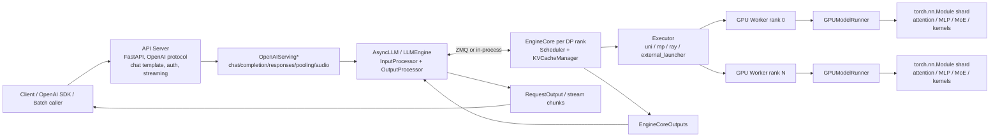
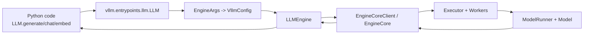
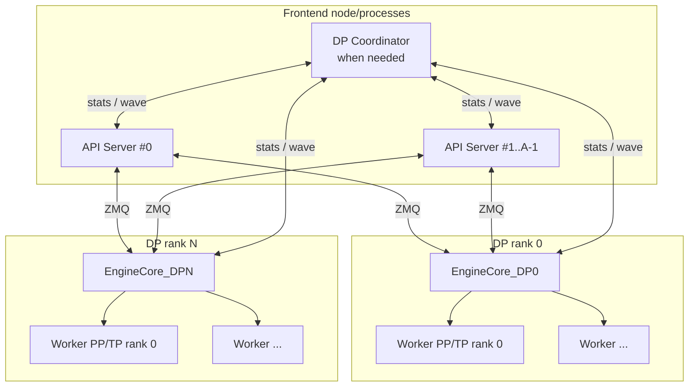
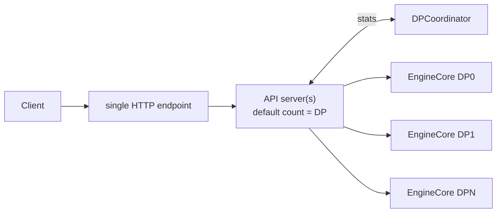
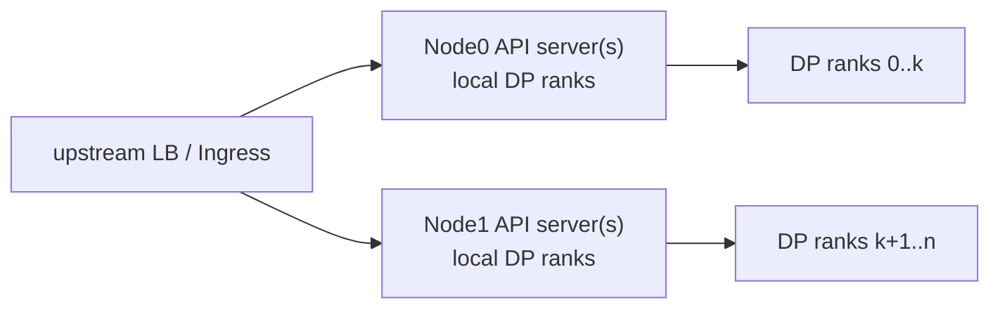
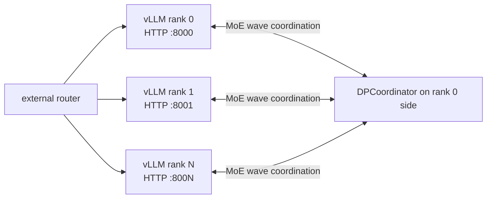
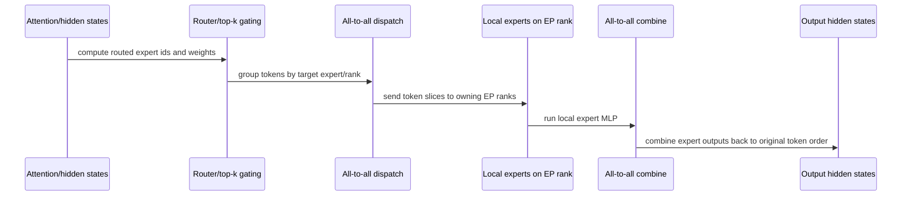
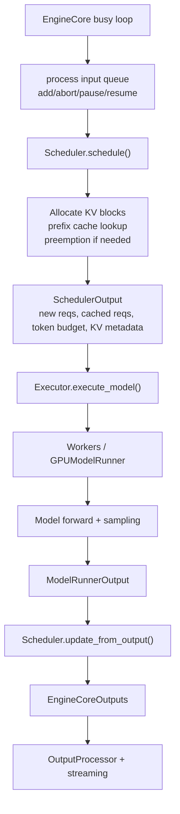

# vLLM 整体架构、部署拓扑与并行组件视图

本文基于当前仓库快照分析 vLLM V1 架构，重点覆盖整体组件视图、请求流转、部署拓扑，以及 TP、PP、DP、EP、DCP、PCP 等并行维度在单机、多机、MoE、长上下文和不同负载均衡模式下的组合关系。

## 1. 总览结论

vLLM V1 的核心不是一个单进程推理循环，而是一套分层的多进程推理运行时：

1. **前端入口层**：`LLM` 离线 Python API、`vllm serve` 在线 OpenAI-compatible API server、可选 render server、gRPC/Rust frontend 等入口负责协议、鉴权、HTTP streaming、chat template、tokenization、多模态输入解析和结果返回。
2. **Engine client 层**：`AsyncLLM` 和 `LLMEngine` 把用户输入转换为 `EngineCoreRequest`，把 `EngineCoreOutputs` 转回 `RequestOutput`，在线模式通过 ZMQ 与后台 EngineCore 通信。
3. **EngineCore 层**：每个 DP rank 通常对应一个 EngineCore。EngineCore 维护调度器、KV cache 管理器、structured output 状态、LoRA 状态、KV connector 元数据，并驱动 executor 执行模型。
4. **Executor/Worker 层**：executor 选择 `uni`、`mp`、`ray` 或 `external_launcher` 后端；多 GPU 下每张 GPU 通常一个 worker 进程。worker 内部持有 `GPUModelRunner`，负责加载模型、准备 batch、attention metadata、CUDA graph、KV cache tensor、采样等。
5. **模型与 kernel 层**：模型类、parallel linear/embedding、attention backend、fused MoE、量化、LoRA、spec decode、KV transfer、offload 等模块组成实际 GPU 热路径。

并行维度可以分成三类：

- **模型切分维度**：TP、PP、PCP、DCP。它们决定一个“模型副本”如何横向切权重、纵向切层、切 prefill/query 或 decode KV cache。
- **副本/流量维度**：DP。它复制一个模型副本的 attention/KV cache 执行环境，用多个 engine rank 吞吐更多请求；MoE 场景下 DP rank 又需要同步 forward wave。
- **MoE 专家维度**：EP/EPLB。EP 只对 MoE expert 层生效，把专家分布到 DP × TP 这些 rank 上；EPLB 在运行时根据专家负载重映射/冗余专家。

最重要的公式：

```text
每个 DP rank 的 worker 数 = TP × PP × PCP
DCP 不增加 worker 数，而是在 TP group 内复用 GPU 来切 decode KV cache
全局 GPU worker 数 = DP × TP × PP × PCP
MoE 的 EP group size = DP × TP × PCP    # 通常 PCP=1，所以常写为 DP × TP
```

`ParallelConfig.world_size` 在当前代码中是 `TP × PP × PCP`，也就是一个 DP rank 内部的模型并行 worker 数；`world_size_across_dp` 才是 `TP × PP × DP` 的全局概念。DCP 被明确设计为“不改变 world size”，它复用 TP group 并要求 `tp_size % dcp_size == 0`。

## 2. 关键源码地图

架构与部署文档：

- `docs/design/arch_overview.md`：V1 process architecture、入口、Engine/Worker/ModelRunner 概览。
- `docs/serving/parallelism_scaling.md`：TP/PP/Ray/MP 多机部署建议。
- `docs/serving/data_parallel_deployment.md`：内部、混合、外部 DP load balancing。
- `docs/serving/expert_parallel_deployment.md`：MoE EP、DeepEP backend、EPLB、PD disaggregation。
- `docs/serving/context_parallel_deployment.md`：PCP/DCP 长上下文部署思路。
- `docs/deployment/k8s.md`、`docs/deployment/docker.md`、`docs/deployment/frameworks/lws.md`：容器/Kubernetes/LWS 部署入口。

配置与启动：

- `vllm/config/parallel.py`：`ParallelConfig` 字段、校验、world size、DP 地址/端口、默认 executor backend。
- `vllm/config/vllm.py`：`VllmConfig.needs_dp_coordinator` 等跨配置判断。
- `vllm/engine/arg_utils.py`：CLI/EngineArgs 归一为 `VllmConfig`，推导 `data_parallel_rank`、`data_parallel_size_local`、地址与端口。
- `vllm/entrypoints/cli/serve.py`：`vllm serve` 根据 headless、multi API server、DP LB 模式选择启动路径。
- `vllm/entrypoints/openai/api_server.py`：FastAPI/OpenAI API server、`AsyncLLM` client 构建、app state 初始化。
- `vllm/entrypoints/openai/dp_supervisor.py`：multi-port external LB 模式下，一进程监督多个 per-rank server。

Engine 与执行链路：

- `vllm/v1/engine/async_llm.py`：在线 `AsyncLLM`，输入处理、后台 output handler、ZMQ EngineCore client。
- `vllm/v1/engine/llm_engine.py`：离线/兼容 `LLMEngine`，同步 step loop。
- `vllm/v1/engine/core.py`：EngineCore、EngineCoreProc、DPEngineCoreProc busy loop、DP dummy batch、wave sync。
- `vllm/v1/engine/utils.py`：EngineCore process/actor manager、ZMQ 地址、DP coordinator 启动。
- `vllm/v1/engine/coordinator.py`：DP coordinator 收集 queue stats、广播 DP wave/start 状态。
- `vllm/v1/core/sched/scheduler.py`：连续批处理调度、KV block 分配、prefix cache、KV connector 元数据。

Executor、Worker 与模型：

- `vllm/v1/executor/abstract.py`：根据 backend 选择 UniProc、Multiproc、Ray、ExternalLauncher executor。
- `vllm/v1/executor/multiproc_executor.py`：本机/多机 MP worker 启动、message queue、collective RPC、PP 输出 rank。
- `vllm/v1/worker/gpu/model_runner.py`：GPU model runner，执行模型、PP intermediate、DP batch sync、采样与 KV connector。
- `vllm/distributed/parallel_state.py`：TP/DCP/PCP/PP/DP/EP/EPLB process group 构造。
- `vllm/model_executor/layers/linear.py`：Column/Row parallel linear，TP 权重切分与 all-gather/all-reduce。
- `vllm/model_executor/models/utils.py`：PP layer range 切分与 `PPMissingLayer`。
- `vllm/model_executor/layers/fused_moe/`：MoE parallel config、all2all prepare/finalize、DeepEP/FlashInfer backend。

## 3. 整体组件视图



这张图可以用一句话概括：**前端负责协议和输入输出，EngineCore 负责调度和 KV cache，worker 负责 GPU 执行，parallel state 决定 worker 间怎么通信。**

### 3.1 在线请求流

在线模式以 `vllm serve` 为主：

1. `vllm/entrypoints/cli/serve.py` 解析 CLI，决定单 API server、多 API server、headless、multi-port supervisor 或普通 `run_server`。
2. `vllm/entrypoints/openai/api_server.py` 创建 FastAPI app，注册 chat/completion/responses/embedding/audio 等 endpoint，并通过 `build_async_engine_client_from_engine_args()` 构造 `AsyncLLM`。
3. `AsyncLLM` 初始化 renderer、`InputProcessor`、`OutputProcessor`，并通过 `EngineCoreClient.make_async_mp_client()` 启动或连接 EngineCore。
4. 请求进入 `OpenAIServing*` 后被 render/tokenize 成 engine input；`AsyncLLM.generate()` 创建 per-request stream，把请求加入 EngineCore。
5. EngineCore busy loop 从输入队列拿请求，Scheduler 为每轮分配 token budget 与 KV blocks，Executor 广播 `SchedulerOutput` 给 worker。
6. worker 的 `GPUModelRunner.execute_model()` 更新本地 request state、准备 attention/KV metadata、执行模型 forward；最后 PP rank 执行 sampling。
7. EngineCore 把 `EngineCoreOutputs` 发回；`AsyncLLM` 的 output handler 处理 detokenization、stop condition、stats，然后把 chunk 推给 HTTP streaming。

### 3.2 离线请求流

离线模式以 `vllm.LLM` 为主：



离线 `LLM.generate()` 会自动批处理输入，并复用同一套 EngineCore、Scheduler、Executor、Worker、ModelRunner。差别在于没有 HTTP server 和 FastAPI state，输出处理在同步 `LLMEngine.step()` 中完成。

## 4. V1 进程模型

V1 的典型在线进程结构如下：



进程数量可按下面估算：

| 类型 | 数量 | 说明 |
| --- | ---: | --- |
| API server | `A` | 默认受 DP LB 模式影响：internal DP 默认 `A=DP`，hybrid 默认 `A=data_parallel_size_local`，external 默认 `A=1` |
| EngineCore | `DP` | 每个 DP rank 一个；headless 节点只启动它管理的 local ranks |
| GPU Worker | `DP × TP × PP × PCP` | 每个 worker 通常绑定一张 GPU；DCP 不额外增加 worker |
| DP Coordinator | 0 或 1 | DP>1 且需要内部/混合 LB stats，或 MoE wave coordination 时启动 |
| DP Supervisor | 0 或 1 | 仅 multi-port external LB 模式，用来拉起多个 per-rank API server |

需要特别区分两个 coordinator/supervisor：

- **DPCoordinator**：Engine 层组件。负责 internal/hybrid DP 的 queue stats 发布；MoE DP 下还负责 request wave/running state 协调。
- **DPSupervisor**：入口层组件。仅在 `--data-parallel-multi-port-external-lb` 下启动，父进程监听 supervisor port，并 fork/spawn 多个独立 per-rank `vllm serve` 子进程，每个子进程有自己的 HTTP port。

## 5. 并行维度总表

| 维度  | 主要目标                     | 是否增加 GPU worker          | 主要切分对象                               | 典型通信                                           | 适用场景                            |
| --- | ------------------------ | ------------------------ | ------------------------------------ | ---------------------------------------------- | ------------------------------- |
| TP  | 单层内横向切权重/activation      | 是                        | linear、embedding、attention heads、MLP | all-gather、all-reduce、reduce-scatter           | 模型无法放单卡，单节点高速互联                 |
| PP  | 按层纵向切模型                  | 是                        | transformer layers                   | stage 间中间张量传递，末 stage 采样后广播 token              | 模型跨节点或 GPU 互联较弱，或层数可切           |
| DP  | 复制模型副本扩吞吐                | 是                        | 整个模型副本、独立 KV cache                   | dense 可独立；MoE 需要 wave/all-reduce/dummy forward | 高吞吐，多副本，MoE DP attention        |
| EP  | MoE expert 分布式放置         | 不单独增加，复用 DP/TP/PCP ranks | expert weights/tokens                | all-to-all dispatch/combine                    | DeepSeek、Qwen-MoE、Mixtral 等 MoE |
| DCP | decode 阶段按序列维切 KV cache  | 否                        | decode KV cache 的 token 维            | all-gather/reduce-scatter 或 all-to-all         | MLA/GQA 长上下文，减少 KV 复制           |
| PCP | prefill 阶段按上下文切 query/KV | 是                        | prefill context/query chunks         | gather/ring attention 等                        | 超长上下文 prefill，仍在快速演进            |

## 6. TP：Tensor Parallel

TP 是单层内部的权重切分。vLLM 的实现沿用 Megatron-LM 风格：

- `ColumnParallelLinear` 把权重矩阵第二维切成 `A=[A1,...,Ap]`，每个 rank 产生局部输出 `Y_i=X A_i`，需要时 all-gather。
- `RowParallelLinear` 把权重矩阵第一维切分，输入也按 hidden 维切分，局部输出后按需 all-reduce。
- `VocabParallelEmbedding` / `ParallelLMHead` 按 vocab 区间切 embedding 和 lm head。

TP 的关键特征：

- 权重在模型初始化/加载期间按 rank 创建和加载，避免每张卡先加载完整大模型再切分。
- 通信发生在层内，通常要求低延迟高带宽互联；单节点 NVLink/NVSwitch 最适合。
- 跨节点 TP 可行，但对网络极敏感；如果跨节点网络不够强，通常优先用 PP 跨节点，把 TP 控制在节点内。

典型命令：

```bash
vllm serve facebook/opt-13b --tensor-parallel-size 4
```

## 7. PP：Pipeline Parallel

PP 按 transformer layer 范围切模型。`make_layers()` 根据 `get_pp_group().rank_in_group` 和 `world_size` 计算当前 stage 的 `start_layer/end_layer`，当前 stage 不拥有的层用 `PPMissingLayer` 占位。

PP 的执行特征：

- first PP rank 通常持有 embedding、处理多模态 embedding。
- middle PP ranks 接收上游 intermediate tensors，执行本 stage layers，再传给下游。
- last PP rank 持有 norm/lm_head 或最终输出相关模块，执行 sampling。
- 使用 PP 时，非 last stage 不产生最终 token；last stage sample 后会把 sampled tokens 广播给前面 stage，用于更新各 stage 的 request state。

典型命令：

```bash
vllm serve gpt2 \
  --tensor-parallel-size 4 \
  --pipeline-parallel-size 2
```

PP 常见用途：

- 模型过大，单节点放不下：设置 `TP=每节点 GPU 数`，`PP=节点数`。
- 单节点 GPU 间没有高速互联：文档建议在某些 L40S 等无 NVLink 环境中考虑 `TP=1, PP=GPU数`，减少层内频繁通信。
- 模型层数不能均匀切 GPU 时：PP 的层切分比 TP 更容易处理不均匀资源。

## 8. DP：Data Parallel

DP 在 vLLM 里需要分两种心智模型：

1. **dense model / 普通吞吐扩展**：每个 DP rank 是一个独立模型副本，拥有独立 KV cache 和独立调度队列。前端把请求分发到不同 rank。
2. **MoE model / DP attention + EP/TP experts**：attention 层按 DP 复制或按 TP 切分，但 expert 层跨 DP rank 形成更大的 expert/tensor group。此时 DP rank 不能完全独立，所有 rank 的 forward wave 需要对齐；空闲 rank 也可能执行 dummy batch 以避免 MoE collective 死锁。

DP 的重要事实：

- `--max-num-seqs` 等调度容量通常是 **每个 DP rank** 的容量，不是全局容量。
- 每个 DP engine 有独立 KV cache。prefix cache 命中率会受到路由策略影响。
- internal/hybrid DP 目前主要依据各 engine 的 running/waiting queue stats 做负载均衡；文档中提到未来可更 KV-cache-aware。
- external DP 对 dense 模型不应使用 `--data-parallel-*` 组合；dense 的外部负载均衡应直接启动多个独立 vLLM 实例。

## 9. DP 负载均衡模式

### 9.1 Internal Load Balancing

Internal LB 是“一个 vLLM 部署暴露一个 HTTP endpoint”，API server 负责把请求路由到所有 DP engine。



单节点例子：

```bash
vllm serve $MODEL --data-parallel-size 4 --tensor-parallel-size 2
```

这需要 `4 × 2 = 8` 张 GPU。默认情况下 API server count 会变成 DP size，也就是 4。

多节点 internal DP 例子：

```bash
# Node 0
vllm serve $MODEL \
  --data-parallel-size 4 \
  --data-parallel-size-local 2 \
  --data-parallel-address 10.99.48.128 \
  --data-parallel-rpc-port 13345

# Node 1
vllm serve $MODEL \
  --headless \
  --data-parallel-size 4 \
  --data-parallel-size-local 2 \
  --data-parallel-start-rank 2 \
  --data-parallel-address 10.99.48.128 \
  --data-parallel-rpc-port 13345
```

Node 0 有 HTTP endpoint；Node 1 只运行 headless engine ranks。API server 可以不和所有 engine 共址。

### 9.2 Hybrid Load Balancing

Hybrid LB 是“每个节点暴露自己的 endpoint，节点内做 local DP LB，节点间交给外部 LB”。



特征：

- 每个节点都不是 headless，都有 API endpoint。
- 必须指定 `--data-parallel-size-local` 和 `--data-parallel-start-rank`。
- 默认 API server count = 本节点 local DP size。
- 好处是减少跨节点 request routing 和单头节点瓶颈。

### 9.3 External Load Balancing

External LB 把每个 DP rank 当成一个独立 HTTP endpoint，由外部 router 分发请求。



同机 MoE external DP 例子：

```bash
CUDA_VISIBLE_DEVICES=0 vllm serve $MODEL \
  --data-parallel-size 2 \
  --data-parallel-rank 0 \
  --port 8000

CUDA_VISIBLE_DEVICES=1 vllm serve $MODEL \
  --data-parallel-size 2 \
  --data-parallel-rank 1 \
  --port 8001
```

多节点时需要显式指定 rank 0 的 DP address/port：

```bash
# Rank 0
vllm serve $MODEL \
  --data-parallel-size 2 \
  --data-parallel-rank 0 \
  --data-parallel-address 10.99.48.128 \
  --data-parallel-rpc-port 13345

# Rank 1
vllm serve $MODEL \
  --data-parallel-size 2 \
  --data-parallel-rank 1 \
  --data-parallel-address 10.99.48.128 \
  --data-parallel-rpc-port 13345
```

外部 LB 的边界：

- 对 MoE DP+EP 有意义，因为各 rank 仍需协调 MoE collective。
- 对 dense 模型，若想外部负载均衡，应启动多个普通 vLLM 实例，不带 `--data-parallel-*`。

### 9.4 Multi-port External LB

`--data-parallel-multi-port-external-lb` 是 external LB 的进程管理变体。一个 supervisor 父进程启动多个 per-rank API server 子进程，每个子进程端口递增：

```text
parent DPSupervisor : supervisor port
child rank 0        : base port + 0
child rank 1        : base port + 1
...
```

它要求 `data_parallel_size_local >= 2`，且目前不支持 gRPC、UDS、HTTPS；父进程负责健康检查、信号转发和异常退出清理。

## 10. EP：Expert Parallel

EP 只对 MoE expert 层生效。开启方式：

```bash
vllm serve deepseek-ai/DeepSeek-V3-0324 \
  --tensor-parallel-size 1 \
  --data-parallel-size 8 \
  --enable-expert-parallel
```

EP 的核心规则：

- `--enable-expert-parallel` 后，expert 层按 EP ranks 分布。
- 常规文档写作 `EP_SIZE = TP_SIZE × DP_SIZE`；在当前 group 构造中若 PCP>1，则 EP group 实际包含 `DP × PCP × TP`，并按 PP stage 分组。
- attention 层不变：`TP=1` 时 attention weights 在 DP ranks 间复制；`TP>1` 时每个 DP group 内 attention 仍按 TP 切。
- 不开 EP 时，MoE expert 层默认仍会走类似 TP 的切分/通信，文档描述为 expert layers 形成大小 `DP × TP` 的 tensor-parallel group。

EP 的 token 流：



EP 通信 backend 由 `--all2all-backend` 选择：

| Backend | 主要用途 |
| --- | --- |
| `allgather_reducescatter` | 默认/通用后端，兼容性优先 |
| `deepep_high_throughput` | 多节点 prefill 或高吞吐场景 |
| `deepep_low_latency` | decode 或低延迟场景 |
| `flashinfer_nvlink_one_sided` | 多节点 NVLink/MNNVL one-sided all2all |
| `flashinfer_nvlink_two_sided` | 多节点 NVLink/MNNVL two-sided all2all |

EPLB 是 EP 的负载均衡增强：

- `--enable-eplb` 启用。
- `--eplb-config` 控制窗口、重平衡间隔、冗余专家、异步模式、通信器等。
- 它会注册 MoE 模型，在 forward/sample 之后周期性收集负载并调整 expert mapping。
- 冗余专家会增加显存占用，不适合 KV cache 已经很紧张的部署。

## 11. DCP 与 PCP：长上下文并行

Context Parallel 主要服务长上下文。当前文档把它分成：

- **PCP / Prefill Context Parallel**：长 prompt prefill 时切 query/context，让多个 GPU 分摊 prefill 计算。它会进入 `ParallelConfig.world_size = TP × PP × PCP`，因此会增加 worker 数。
- **DCP / Decode Context Parallel**：decode 时 query 很短、KV 很长，瓶颈通常是 KV cache 容量与读取。DCP 在 TP group 内沿 token 维切 KV cache，不增加 worker 数。

DCP 的边界：

- `decode_context_parallel_size` 必须整除 `tensor_parallel_size`。
- DCP 不改变 world size，只是在 TP group 内切出 DCP group。
- `dcp_comm_backend="a2a"` 要求 `dcp_size > 1`。
- `GPUModelRunner.initialize_kv_cache()` 里会把每个 rank 的 block table 按 `block_size × dcp_size` 解释，也就是单 rank 的一个 KV block 覆盖全局未切序列中的更多 token 范围。

典型场景：

- DeepSeek-R1 MLA 只有 1 个 KV head，`-tp 8` 会造成 KV cache 高复制；可尝试 `-dcp 8` 减少复制。
- Qwen3-235B-A22B 这类 4 KV heads 模型，`-tp 8` 可能有 2 倍 KV 复制；可用 `-dcp 2` 消除。

## 12. Scheduler 与 KV Cache 流转逻辑

Scheduler 的设计里没有硬编码“prefill 阶段”和“decode 阶段”。每个 request 只有：

- 已计算 token 数：`num_computed_tokens`
- 目标 token 数：prompt tokens + output tokens + speculative tokens
- 每轮调度让 `num_computed_tokens` 尽量追上目标 token 数

这使同一套调度可以覆盖：

- chunked prefill
- prefix caching
- speculative decoding
- streaming input
- KV transfer/offloading
- future jump decoding 类优化

每轮 EngineCore step 的逻辑可以抽象成：



KV cache 的关键点：

- Scheduler 侧的 `KVCacheManager` 管理 block 分配、释放、prefix cache、eviction events。
- Worker 侧的 `GPUModelRunner` 持有真实 GPU KV tensors 和 block table。
- `SchedulerOutput` 把每轮新增 block、slot mapping、cached request data、KV connector metadata 传给 worker。
- prefix cache 命中能减少 prefill 计算，但 DP 模式下每个 rank 的 KV cache 独立，所以路由策略会影响命中率。
- KV connector 会在 scheduler 和 worker 两侧各创建 connector，用于 disaggregated prefill/decode、KV offload、remote KV pull/push 等场景。

## 13. Worker / ModelRunner 执行细节

`GPUModelRunner.execute_model()` 的主路径：

1. 非 dummy run 时，先处理 finished/free/new/cached request state，并把 staged block table 写入生效。
2. 计算本轮 `num_reqs`、`num_toks`、`uniform_tok_count`，调用 DP sync 逻辑统一 CUDA graph/eager 运行选择。
3. 如果所有 DP rank 都没有 token，则走 `kv_connector.no_forward()`，不执行模型。
4. 准备输入 tensor、attention metadata、slot mapping、LoRA mapping、多模态 embedding。
5. first PP rank 负责多模态 embedding；非 first PP rank 接收 upstream intermediate tensors。
6. 根据 CUDA graph mode 决定 replay fullgraph，或者在 `set_forward_context()` 内普通调用 `self.model(**model_inputs)`。
7. 非 last PP rank 返回 intermediate tensors；last PP rank 得到 hidden states。
8. last PP rank 执行 sample/pool，PP 模式下把 sampled tokens 广播给非 last ranks。
9. KV connector 执行 pre/post forward hook，输出 KV transfer/offload metadata。

这条路径解释了为什么 vLLM 的组件边界是“Scheduler 计划 token 与 KV，Worker 执行 tensor 与 kernel，OutputProcessor 处理文本与 stop condition”。

## 14. 跨节点部署视图

### 14.1 Dense / 普通大模型跨节点：TP + PP

当单节点放不下模型时，最常见策略是：

```text
TP = 每节点 GPU 数
PP = 节点数
DP = 1
```

Ray cluster 方式：

```bash
vllm serve /path/to/model \
  --tensor-parallel-size 8 \
  --pipeline-parallel-size 2 \
  --distributed-executor-backend ray
```

Multiprocessing 多节点方式：

```bash
# Head node
vllm serve /path/to/model \
  --tensor-parallel-size 8 \
  --pipeline-parallel-size 2 \
  --nnodes 2 \
  --node-rank 0 \
  --master-addr <HEAD_NODE_IP>

# Worker node
vllm serve /path/to/model \
  --tensor-parallel-size 8 \
  --pipeline-parallel-size 2 \
  --nnodes 2 \
  --node-rank 1 \
  --master-addr <HEAD_NODE_IP> \
  --headless
```

此时跨节点通信主要是 PP stage 间 activation/intermediate tensors，而 TP 通常尽量留在节点内。

### 14.2 Dense 多副本跨节点：DP internal/hybrid 或独立实例

如果目标是吞吐而不是单副本装载能力：

- 小/中等规模：internal DP 暴露单 endpoint，方便。
- 大规模多节点：hybrid DP 可以避免所有请求集中到一个头节点。
- 已有成熟网关/router：dense 模型可直接启动多个独立 vLLM 实例，不使用 `--data-parallel-*`，由外部系统做路由。

### 14.3 MoE 跨节点：DP + EP + DeepEP

MoE 大模型的高效部署通常是：

```text
attention: DP 或 DP×TP
experts: EP = DP×TP
all2all backend: deepep_high_throughput 或 deepep_low_latency
```

两节点 DeepEP low-latency 示例：

```bash
# Node 1
vllm serve deepseek-ai/DeepSeek-V3-0324 \
  --all2all-backend deepep_low_latency \
  --tensor-parallel-size 1 \
  --enable-expert-parallel \
  --data-parallel-size 16 \
  --data-parallel-size-local 8 \
  --data-parallel-address 192.168.1.100 \
  --data-parallel-rpc-port 13345 \
  --api-server-count 8

# Node 2
vllm serve deepseek-ai/DeepSeek-V3-0324 \
  --all2all-backend deepep_low_latency \
  --tensor-parallel-size 1 \
  --enable-expert-parallel \
  --data-parallel-size 16 \
  --data-parallel-size-local 8 \
  --data-parallel-start-rank 8 \
  --data-parallel-address 192.168.1.100 \
  --data-parallel-rpc-port 13345 \
  --headless
```

在 InfiniBand/RoCE 集群上，注意：

- 初始 torch distributed group discovery 可能需要设置 `GLOO_SOCKET_IFNAME=eth0`。
- NCCL/DeepEP/NVSHMEM 需要正确网卡、驱动、`ulimit -l`、容器权限和 host network。
- 如果 NCCL 日志显示跨节点走 `NET/Socket` 而不是 `NET/IB/GDRDMA`，性能会非常差。

### 14.4 Ray DP backend

DP 也可以指定 `--data-parallel-backend=ray`：

```bash
vllm serve $MODEL \
  --data-parallel-size 4 \
  --data-parallel-size-local 2 \
  --data-parallel-backend ray
```

Ray 的差异：

- 通常一个 launch command 可以启动本地和远端 DP ranks。
- 不必手工指定 `data_parallel_address` 和 `data_parallel_rpc_port`。
- 如果单个 DP rank 本身需要跨多个节点，文档建议设置 `VLLM_RAY_DP_PACK_STRATEGY=span`，让 Ray placement group 跨节点收集一个 DP rank 所需 GPU。

## 15. 部署场景速查

| 场景 | 推荐并行/部署 | 原因与注意点 |
| --- | --- | --- |
| 模型单卡可放下，QPS 不高 | `TP=PP=DP=1` | 架构最简单，`uni` 或单 worker |
| 模型单卡放不下，单节点多 GPU 可放下 | `TP=GPU数` | 层内切权重，要求节点内通信好 |
| 单节点无高速 GPU 互联 | `TP=1, PP=GPU数` 或较小 TP | 减少层内 collective，靠层间传递 |
| 模型跨节点才能放下 | `TP=每节点GPU数, PP=节点数` | 把频繁 TP 通信留在节点内 |
| dense 模型扩吞吐，想单 endpoint | internal DP | API server 内部按 queue stats 路由 |
| dense 模型大规模生产路由 | 多个独立 vLLM 实例 + 外部 LB | dense external DP 不需要 `--data-parallel-*` |
| 每节点暴露 endpoint，节点间有 ingress | hybrid DP | 节点内 internal LB，节点间外部 LB |
| MoE 单节点大吞吐 | `DP=N, TP=1, --enable-expert-parallel` | attention 复制，experts 分布到所有 GPU |
| MoE 单节点 attention 也需切 | `DP×TP, --enable-expert-parallel` | attention 每个 DP group 内 TP，EP 跨 DP×TP |
| MoE 跨节点 | DP+EP + DeepEP backend | 注意 all2all 网络与 wave coordination |
| 长上下文 decode KV cache 紧张 | 在 TP 内加 `--decode-context-parallel-size` | DCP 减 KV 复制，不加 GPU |
| Prefill/decode SLA 差异大 | disaggregated serving + KV connector | prefill/decode 独立扩缩容，需 KV transfer |

## 16. 几个容易混淆的点

### 16.1 DP 和“多副本”不是永远等价

dense 模型里 DP rank 更接近独立副本；MoE DP+EP 里 DP rank 是同一个 MoE collective 拓扑的一部分，必须同步 forward wave，否则 expert all-to-all 可能死锁。因此 `DPEngineCoreProc` 会在没有本地 ready request 时执行 dummy batch，并每隔固定步数通过 DP group all-reduce 判断全局是否都完成。

### 16.2 EP 不等于新增一组 GPU

EP 复用已经由 DP/TP/PCP 创建出来的 ranks。开启 EP 后，是 MoE expert 层改为按 EP group 分布；attention 层仍按 DP/TP 规则执行。

### 16.3 DCP 不等于 PP 或 TP

DCP 不增加 worker，也不切模型层；它复用 TP group，把 decode KV cache 沿序列/token 维切开。它主要解决 MLA/GQA 长上下文下 KV cache 复制问题。

### 16.4 API server count 与 DP rank 数不是一个概念

API server count 控制前端进程数量，DP size 控制 engine rank 数量。internal DP 默认把 API server count 设为 DP size，但这只是默认扩展策略；hybrid/external/multi-port 都有不同默认。

### 16.5 `world_size` 语义有层次

在 `ParallelConfig` 里：

- `world_size = TP × PP × PCP`
- `world_size_across_dp = world_size × DP`
- DCP 不进入 `world_size`
- external launcher 模式会有额外 rank 语义，代码会从环境变量推导 DP rank

### 16.6 跨节点时环境一致性很重要

多节点启动要求每个节点模型路径、Python 包、CUDA/NCCL/driver、容器镜像、HF cache 可见性一致。文档建议预下载模型到每个节点相同路径，或者使用共享文件系统。

## 17. 推荐阅读顺序

如果要继续深挖，建议按这个顺序读代码：

1. `docs/design/arch_overview.md`
2. `vllm/engine/arg_utils.py:create_engine_config`
3. `vllm/config/parallel.py:ParallelConfig`
4. `vllm/entrypoints/cli/serve.py`
5. `vllm/entrypoints/openai/api_server.py`
6. `vllm/v1/engine/async_llm.py`
7. `vllm/v1/engine/core.py`
8. `vllm/v1/core/sched/scheduler.py`
9. `vllm/v1/executor/abstract.py` 与 `vllm/v1/executor/multiproc_executor.py`
10. `vllm/v1/worker/gpu/model_runner.py`
11. `vllm/distributed/parallel_state.py`
12. MoE 场景再读 `vllm/model_executor/layers/fused_moe/`

## 18. 一句话架构心智模型

vLLM 的部署拓扑可以先按 **DP rank** 切成多个 engine 副本，再在每个 DP rank 内按 **TP/PP/PCP/DCP** 切一个模型副本；如果模型是 MoE，再让 expert 层跨 **DP×TP×PCP** 形成 EP group。前端 API server 只负责把请求路由给合适的 EngineCore，真正的吞吐、延迟、显存与通信权衡，都落在 Scheduler 的 KV block 管理和 Worker/ModelRunner 的并行 group 执行上。
